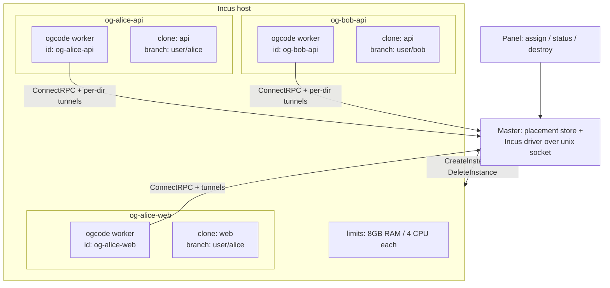

# Incus Workers Plan (container-per-assignment isolation)

Status: **Phase B implemented (2026-09-15) — master-side driver + placement store, unit-tested against a REST fake; awaiting a live Incus run.** This plan supersedes the *worktree mechanic* of
`MULTI_USER_REPOS_PLAN.md` (Phases 0–3 implemented: assignment flow, provisioning, scoped
login, logical targeting) by replacing git-worktree isolation with one Incus container per
user-repo assignment. The assignment UX, the ConnectRPC channel, tunnels, and the session
lifecycle carry over unchanged; only the provisioning primitive changes (worktree → container).
Grounding audit done 2026-09-15; every cited file/line verified. Incus client API verified
against `github.com/lxc/incus/v6/client` documentation and `incus-demo-server`.

**Phase B landed here** (controlplane module, CGO-free): `internal/incus` driver
(`Create`/`Delete`/`State`/`ListAssignments` over the unix socket, `SkipGetEvents` polling
waits), `internal/master/placement.go` (Placement + bbolt `placements` bucket + container
name math mirroring `scripts/incus/assign.sh`, NAME_BUDGET=40), forks in
`AssignUser`/`RemoveUserWorktree`/`DeprovisionRepo`/`StartUserSession` (nil `incus` block =
bare behavior byte-for-byte), Register hook completing pending placements, provisioning
reaper, config `master.incus` block with defaults/validation, placements table with
Create/Destroy on the Repositories page, `Deprecated:` notes on proto cases 10/11/13.
Tests: config round-trip/validation, driver vs unix-socket REST fake, idempotent
re-assign, re-provision on missing container, create-failure→failed, capacity, register
completes pending, start-session readiness gate, destroy/deprovision bookkeeping, name
math parity. Phase A scripts remain the manual operator path; Phase C (multi-host,
reconciliation) is next.

## Problem

The implemented multi-user model isolates users with **git worktrees**: one clone on one
worker, every user gets `clone/.ogcode/worktrees/user/<name>` (`internal/worker/repos.go:158`,
`internal/worker/workspaces.go`). Isolation is *conventional*, not enforced:

- Users share one OS process tree, one filesystem, one worker process. Nothing stops a
  session in one user's worktree from reading another user's worktree, the shared clone's
  `main`, or the machine-global ogcode state (`~/.ogcode/config.db`, MCP tokens).
- Resource use is unbounded: one worker hosts N users; a runaway build in one worktree
  starves everyone (no per-user CPU/memory ceiling).
- Deprovisioning is surgery: `RemoveUserWorktree` + branch cleanup on a live machine that
  also hosts other users (`internal/worker/repos.go:420`).
- Capacity is guessed from `Stats.free_bytes` of a shared machine
  (`controlplane/internal/master/repos.go:161-201`, `pickWorker`), which stops predicting
  anything once a host hosts several assignments.
- Failure domains overlap: a crashed worker kills every assignment on it.

Containers fix all four at once: **one container per user-repo assignment** gives OS-level
isolation, hard per-assignment limits, trivial deprovisioning (`incus delete`), and an honest
capacity model (containers per host).

## Design summary

A **placement** is the new grain: `<user, repoURL> → container`. Assigning a user to a repo
creates (or reuses) one Incus container named `og-<reposlug>-<user>`, seeded with the repo
URL; the container boots a golden image whose systemd units clone the repo and run
`ogcode worker`. The worker registers with the master using its **container name as worker id**
(cloud-init writes `/root/.ogcode/worker-id` — `loadOrCreateWorkerID`,
`internal/worker/workerid.go:22-56`, prefers an existing file, so this needs **zero Go
changes**). Unassigning destroys the container. The `user/<name>` branch model survives; the
worktree survives as a harmless in-container detail (Phase A/B) and is dropped in Phase C.



### Decisions confirmed by the developer

1. **Grain: one container per user-repo assignment.** Assign = create container + clone;
   unassign = plain container delete, no worktree surgery. A per-*repo* container (users
   sharing one guest) and multi-clone-in-one-guest were both explicitly rejected — shared
   guests reintroduce exactly the isolation and resource problems this plan exists to remove.
2. **Worker runs inside each container** — not one host worker driven via `incus exec`.
   Independent failure domains, per-container `limits.memory`/`limits.cpu`.
3. **No `incus exec` for in-container work.** The master's typed command path
   (`StartAgent`, guidance, approve/reject) already reaches the in-guest worker over
   ConnectRPC; `incus exec` would bypass and duplicate it.
4. **Auto-restart:** `boot.autostart` on the container + systemd `Restart=always` on the
   in-guest worker. A container crash recovers without master involvement.
5. **Readiness signal = worker registration**, not an Incus operation. `Server.Call`'s
   30s command timeout (`controlplane/internal/master/server.go:33`,
   `DefaultCommandTimeout = 30s`) must never sit in the provisioning path — provisioning is
   async: create, then wait for the worker's `Register` (see *Provisioning flow*).
6. **Phase A = wrap, don't rewrite.** A scripted container lifecycle around the *existing*
   master/worker before any driver code; Phase B = master-side Incus driver + placement
   store; Phase C = image evolution (Android Studio / headless Chrome layers, per-project
   profiles).
7. `user/<name>` branches survive (they are the merge-back unit). Task worktrees
   (`internal/git/git.go`, `CreateTaskWorktree`) are out of scope and unchanged.

### What carries over unchanged

| Piece | Why it survives verbatim |
|---|---|
| ConnectRPC worker protocol, pairing secret, token TTL | In-guest worker is the same binary dialing the same master (`internal/worker/worker.go:56-79` Options) |
| Tunnels — worker-initiated, per-directory, master-keyed `<workerID>-<route>` (`controlplane/internal/master/tunnel.go:33-102`) | Worker id *is* the container name, so keys and eviction stay unique per assignment |
| `StartAgent` logical targeting (`workspace` + `repo_url` + `user_name`, proto fields 2/8/9) | Master fills both from the placement record; `startAgent` (`internal/worker/worker.go:560-619`) resolves clone + worktree as an idempotent backstop exactly as today |
| Registry: stable worker id, token TTL, heartbeat, reap (`controlplane/internal/registry/`) | Worker id = container name; DNS-safe (`validWorkerID`, `server.go:454-474`) |
| Operator accounts, allowlist, scoped login | `UserRecord.Repos` / `WithRepoAdded` / `WithRepoRemoved` (`controlplane/internal/registry/store.go:54-66`) reused; only *placement* resolution changes |
| Per-user panel proxy + tunnel routing | URL label becomes the container name (see *Tunnels, URLs, allowlist*) |
| `merge_user_branch` (proto 15) | Still a worker-side git op against the in-container clone (`internal/worker/repos.go:453`) |

---

## Container grain, naming, and worker identity

**Name scheme:** `og-<reposlug>-<user>`. The repo segment reuses `repoSlugFromURL`
(`controlplane/internal/master/repos.go:88-110`) — the same slug the worker's `safeRepoName`
(`internal/worker/repos.go:69`) derives, which must stay byte-identical with it. The user
segment passes through `safeUserName` (`internal/worker/repos.go:226`). Sanitized segments are
already DNS-safe; the composite must satisfy `validWorkerID` (1–63 bytes, lowercase alnum +
hyphen, `server.go:454-474`) — cap the container name at 63 bytes with the same budget-trim
order `routeLabel` uses (repo trimmed first, user survives; `internal/worker/tunnel.go:145-168`).

**Worker identity = container name.** `loadOrCreateWorkerID` reads
`~/.ogcode/worker-id` before minting (`internal/worker/workerid.go:29-33`), so the seed writes
the container name there. Consequences, all free:

- The master's `Register` adopts the stable id (`server.go:113-145`) — the registry, token
  store, session routing (`RouteSession`/`WorkerForSession`), and `sessionsForWorker` joins
  all key on the container name without any changes.
- **Worker-id uniqueness is global** because the registry is global; when Phase B/C adds a
  second Incus host, the placement store (not Incus) enforces unique names across hosts —
  Incus guarantees uniqueness only per host. The placement store keyed by
  `<user, repoURL>` already provides this.
- A duplicate/stale id (reused container name after an unclean delete) is safe: `Register`
  with the same id is an idempotent re-adopt.

**Clone placement in the guest:** `~/.ogcode/repos/<slug>` — the worker's `DefaultRepoRoot`
(`internal/worker/repos.go:58`) — and the worker is started with
`--repo-root ~/.ogcode/repos --workspace ~/.ogcode/repos` (the containment pairing the CLI
flag documents, `internal/cli/worker.go:48`). `workspaceAllowed`
(`internal/worker/worker.go:621-638`) containment then holds exactly as today.

**The worktree stays, for now.** `startAgent`'s logical-targeting backstop
(`EnsureRepo` + `EnsureUserWorktree`, `internal/worker/worker.go:560-619`) still creates the
`user/<name>` worktree inside the container on first session. With one user per container it
is no longer the isolation boundary — the container is — but keeping it means **Phase A and
B ship with zero worker-side Go changes** and `routeLabel`'s
`<reposlug>-<user>` composite (`internal/worker/tunnel.go:145-168`) keeps qualifying tunnel
routes as today. Phase C collapses it (below).

## Golden image, profile, cloud-init

One image, one profile, one small per-instance seed.

**Image `ogcode-base`** (Ubuntu 24.04 LTS, built by script, published as a local alias):

- `git`, `ca-certificates`, `cloud-init` (present in cloud images), `openssh-client`.
- The `ogcode` binary at `/usr/local/bin/ogcode` (built from the same commit as the master —
  image rebuild is per ogcode release; see risks).
- systemd units (below), plus a `ogcode-clone` oneshot that performs the assignment's clone
  before the worker starts.

**Profile `ogcode-worker`:**

```yaml
config:
  limits.memory: 8GB
  limits.cpu: "4"
  limits.memory.swap: "false"
  boot.autostart: "true"
  security.devlxd: "false"        # guests don't get the devlxd socket
  # per-deployment values that are the same for every container of a master:
  user.ogcode.master-url: https://master:8443
  user.ogcode.pairing-secret: <from master config>   # see risks
  user.ogcode.master-ca: <PEM, when private CA>
description: ogcode worker baseline
devices: {}
```

Profile-level `user.user-data` carries the deployment-wide parts (master URL, pairing
secret, CA); the **per-instance** seed carries only the two assignment-specific values, set
as instance config keys at creation so they are visible in `incus config show`:

| Key | Value |
|---|---|
| `user.ogcode.worker-id` | container name (rendered into `/root/.ogcode/worker-id` by cloud-init) |
| `user.ogcode.repo-url` | the assigned repo's clone URL |
| `user.ogcode.base-branch` | branch the `user/<name>` branch forks from (today: `defaultBranch`, `internal/worker/repos.go:266`) |

**In-guest units:**

```ini
# ogcode-clone.service (oneshot) — runs BEFORE the worker so eager tunnels see the clone
[Service]
Type=oneshot
ExecStart=/usr/bin/git clone --origin origin --branch <base-branch> <repo-url> /root/.ogcode/repos/<slug>
RemainAfterExit=yes
```

```ini
# ogcode-worker.service — the one thing that must always be running
[Unit]
After=ogcode-clone.service
Requires=ogcode-clone.service

[Service]
ExecStart=/usr/local/bin/ogcode worker \
  --master <master-url> \
  --name <container-name> \
  --repo-root /root/.ogcode/repos \
  --workspace /root/.ogcode/repos \
  --pairing-secret-file /etc/ogcode/pairing-secret \
  --master-ca /etc/ogcode/master-ca.pem
Restart=always
RestartSec=5

[Install]
WantedBy=multi-user.target
```

The flags mirror `internal/cli/worker.go:45-52` exactly; the pairing secret rides in an
`EnvironmentFile` (`OGCODE_PAIRING_SECRET`, mode 0600) so it is never in process args.
`Restart=always` + `RestartSec=5` + worker's own dial-backoff
(`internal/worker/worker.go` Run loop) means boot-order races self-heal.

**Big repos:** for a multi-GB clone, the profile can instead mount a **host-side bare
mirror** as a disk device (`path: /srv/mirrors/<slug>, source: <pool>/mirrors/<slug>`) and
the clone oneshot does
`git clone --reference /srv/mirrors/<slug> <repo-url> …` — objects transfer over the local
bridge, only refs hit the network. This is Phase C; the plain remote clone works from day
one (the container has outbound NAT via `incusbr0`, so the git remote must be reachable
from the guest — same requirement the worker host has today).

## Master-side Incus driver

The master talks to the local Incus daemon over its **unix socket** using the official
Go client — no shelling out to `incus`:

- Dependency: `github.com/lxc/incus/v6` (module `client` + `shared/api`), pure Go, CGO-free,
  safe for the Dockerized master. Current stable line v6.x (v6.23.0); v7 is tagged upstream —
  pin /v6, bump with daemon upgrades.
- Connect: `incus.ConnectIncusUnix("", nil)` — empty URL = the daemon's default local socket
  (`/var/lib/incus/unix.socket`); the master process must be in the daemon's socket-access
  group. (Function name is `ConnectIncusUnix`, not `ConnectIncusUnixSocket`.) Returns an
  `InstanceServer`.
- Create: `c.CreateInstance(api.InstancesPost{Name: <container name>, Type: "container",
  Source: api.InstanceSource{Type: "image", Alias: "ogcode-base"},
  Profiles: ["ogcode-worker"], Config: {limits…, user.ogcode.*: …}})` → background
  `Operation` → `op.Wait()`.
- Start: `c.UpdateInstanceState(name, api.InstanceStatePut{Action: "start", Timeout: -1}, "")`
  → `op.Wait()`.
- Delete: `c.DeleteInstance(name, …)` → `op.Wait()` (force after grace).
- State/status: `GetInstanceState`, `GetInstances` (by naming prefix `og-`), and
  `Server.GetResources()` for host capacity.
- Reference architecture: `incus-demo-server` — a small Go daemon doing exactly
  create-with-limits → auto-delete lifecycle over the same client. Our driver is the same
  shape, plus placement bookkeeping.

Driver interface (kept narrow so tests fake it):

```go
// controlplane/internal/incus/driver.go
type Driver interface {
    Create(ctx context.Context, name string, seed Seed) error // create+start, op.Wait inside
    Delete(ctx context.Context, name string) error
    State(ctx context.Context, name string) (InstanceState, error) // running/stopped/missing
    ListAssignments(ctx context.Context) ([]Assignment, error)    // prefix og-
}
```

**New config block** (`controlplane/internal/config/config.go`, alongside `MasterConfig`):

```jsonc
{
  "master": { … },
  "incus": {                       // presence = container mode enabled
    "socket": "",                  // default: daemon's local unix socket
    "profile": "ogcode-worker",
    "imageAlias": "ogcode-base",
    "namePrefix": "og-",
    "maxContainersPerHost": 20,    // placement capacity (Phase B: one host)
    "registerTimeoutSeconds": 600, // placement pending → failed
    "masterURL": ""                // what in-guest workers dial (defaults to master.listen-derived)
  }
}
```

Nil `incus` block ⇒ today's behavior, byte-for-byte (see *Migration*).

## Placement replaces the repo store grain

`repoStore` — the in-memory `repoRecord{URL, WorkerID}` map
(`controlplane/internal/master/repos.go:21-63`) — records *which worker holds a repo*. Under
container-per-assignment a repo can be held by **several containers** (one per user), and the
durable grain is the assignment. New store:

```go
// controlplane/internal/master/placement.go
type Placement struct {
    User, RepoURL   string
    ContainerName   string   // == worker id
    Status          string   // provisioning | ready | failed
    CreatedAt       time.Time
}
type PlacementStore struct{ … }  // new bbolt bucket "placements" (registry store
                                 // already buckets workers/tokens/sessions/users, store.go:21-24)
```

`UserRecord.Repos` (`store.go:54-66`) stays the account-side truth (what the user can see);
the placement store is the operational side (what exists and where). `repoStore` remains only
for bare-worker mode.

## Provisioning flow

```mermaid
sequenceDiagram
    participant OP as Operator (panel)
    participant M as Master
    participant D as Incus driver
    participant I as Incus daemon
    participant G as Guest (cloud-init → systemd)
    participant W as ogcode worker

    OP->>M: assign user → repo
    M->>M: validate account; placement exists?
    alt placement ready/provisioning
        M-->>OP: return existing placement (idempotent)
    else none
        M->>D: Create(og-<slug>-<user>, seed{id, repo, base})
        D->>I: POST /1.0/instances → op.Wait()
        D->>I: PUT state=start → op.Wait()
        I-->>G: boot → cloud-init writes worker-id → clone oneshot → worker starts
        M-->>OP: 202 {status: provisioning}
        W->>M: Register(worker_id = og-<slug>-<user>)
        M->>M: pending placement matches id → status=ready
        Note over M: tunnels appear (eager, per-dir);<br/>panel URL <container>.<panel host> live
    end
    OP->>M: (later) start session on placement
    M->>M: StartUserSession — placement must be ready (server.go:347-359)
```

- **Timeouts:** provisioning is **async from the operator's view** (panel shows
  `provisioning` → `ready`/`failed`); the master completes a pending placement when a
  `Register` arrives with the expected id, and a reaper fails placements still pending after
  `registerTimeoutSeconds` (default 600s). This deliberately bypasses
  `DefaultCommandTimeout = 30s` (`server.go:33`) — create+boot+clone is minutes, and no
  worker `Call` is involved at all (the driver is a local unix-socket HTTP client, not a
  pending-command round trip like `Call`, `server.go:263-282`).
- **Operator handler timeouts** (`cloneTimeout`/`lifecycleTimeout` = 5 min,
  `controlplane/internal/master/repos_ui.go:30-36`) stop bounding provisioning; they remain
  for bare-worker mode's synchronous clone path.
- **Failure:** pending → failed; the panel offers Destroy (driver delete) so a half-born
  container never lingers. A `Register` from a container the placement store doesn't expect
  is still admitted (it may be an operator-created container), but it never auto-completes
  anyone's placement.
- **Idempotency:** re-assigning an existing `<user, repo>` returns the live placement; if the
  container is missing (crash-looped, manually deleted) the placement is re-provisioned.
  `AssignUser`'s current re-entry rules (`repos.go:203-298`: account must exist, not admin,
  `WithRepoAdded`, allowlist auto-pin) apply unchanged, with `userWorktreeSlug`'s
  auto-pin target becoming the placement label.

## Proto surface: what changes, what goes vestigial

**Phase A/B require NO protobuf changes.** The Incus driver is master-side; in-guest workers
are ordinary workers. The existing `MasterToWorker` oneof (`controlplane/proto/controlplane/v1/controlplane.proto`)
fate per case:

| Case | Command | Container mode |
|---|---|---|
| 2 | `start_agent` | **Kept** — logical targeting still drives first-session provisioning backstop |
| 3–7 | stop/abort/guidance/approve/reject | **Kept** verbatim |
| 8 | `list_workspaces` | **Kept** (panel workspace list) |
| 9 | `ping` | **Kept** (heartbeat) |
| 10 | `add_user_worktree` | **Vestigial in container mode** — assignment provisioning is container create; never sent to container workers. Kept for bare-worker mode. |
| 11 | `list_repos` | **Vestigial in container mode** (placement store answers). Kept for bare-worker mode. |
| 12 | `stats` | **Kept** for panel observability; **no longer drives placement** (see below) |
| 13 | `clone_repo` | **Vestigial in container mode** — the guest's clone oneshot replaces it. Kept for bare-worker mode. |
| 14 | `remove_user_worktree` | **Replaced** by master-side `Delete` (container destroy) |
| 15 | `merge_user_branch` | **Kept** — still runs in-guest against the container clone (`repos.go:453`) |
| 16 | `deprovision_repo` | **Replaced** — master iterates placements for the repo and deletes each container |

Removal (not just deprecation) is a Phase C cleanup **after** bare-worker mode is retired, so
the wire stays compatible with old workers until then. Add `// Deprecated:` comments in the
proto when Phase B lands.

## Master command rework

| Master command (`repos.go`) | Before (bare workers) | After (container mode) |
|---|---|---|
| `AssignUser` (203-298) | `pickWorker` → `Call(AddUserWorktree)` → `repos.set` | validate + upsert **Placement** → driver `Create` → async wait for `Register`. No worker `Call`. |
| `pickWorker` (161-201) | max `free_bytes` via `Stats` call over online workers | replaced by **host capacity model**: Phase B = single host, capacity = `maxContainersPerHost`; Phase C = per-host driver + `GetResources()` storage check. `Stats.free_bytes` no longer predicts container capacity. |
| `RemoveUserWorktree` (300-332) | `Call(RemoveUserWorktree)`, `KeepBranch=true` | driver `Delete` + placement forget. **Branch safety:** unpushed commits die with the container — best-effort final `git push origin user/<name>` before delete, surfaced as a warning in the panel. |
| `MergeUserBranch` (334-367) | `Call(MergeUserBranch)` | unchanged — still a worker command, now over a container's tunnel |
| `DeprovisionRepo` (369-448) | forget placement + drop from accounts + unroute sessions | driver `Delete` **per placement of that repo** + same store bookkeeping (`WithRepoRemoved` via `store.ListUsers`, unroute via `SessionsForWorker` + `sessionUsers`) |

Unrouting on destroy reuses `DeprovisionRepo`'s session bookkeeping — extract it into a
shared helper rather than duplicating it.

## Tunnels, URLs, allowlist

- Tunnel mechanics are untouched: the in-guest worker dials out and opens per-directory
  tunnels (`internal/worker/tunnel.go`); the master keys them `<workerID>-<route>`
  (`tunnel.go:33-102`). With worker id = container name, keys become
  `og-alice-api-<reposlug>-<user>` (routeLabel's composite) — unique per assignment because
  the container is.
- Panel URLs become `<container-name>.<panel host>` (README's
  `<workerId>-<worktree>.panel.example.com` table) — the label an operator recognizes is the
  container name, and the route composite keeps it recognizable. The **63-byte cap matters**:
  container name (≤63) + route (≤63) can jointly overflow a DNS label; the placement store
  should cap container names at ~40 bytes (trim repo slug first, same rule as
  `routeLabel:156-167`).
- **Allowlist:** today assignment auto-pins the account's workspaces to `userWorktreeSlug`
  (`repos.go:203-298`). The concept survives — the pin becomes the placement's label — and
  `workspaceAllowed` containment (`worker.go:621-638`) is unchanged on the worker side.
  Operator *logins* are unaffected (operator cookie/session is master-side).
- Eager tunnels (`ensureEagerTunnels`, `worker.go:656-679`) work because the clone oneshot
  runs before the worker starts: at connect time the workspace already exists, so the
  per-dir tunnel opens immediately. (Without the systemd ordering, the first session's
  `tunnelAndRelayOnce` would still cover it — ordering is a UX nicety, not a correctness
  dependency.)

## Phases

### Phase A — wrap, don't rewrite (scripted lifecycle)

Ship the container model as **operator scripts** before any Go changes. Proves the image,
cloud-init seed, systemd units, and the "registration = ready" contract end-to-end with the
*implemented* master (Phases 0–3 of `MULTI_USER_REPOS_PLAN.md`): an operator creates a
container with the script, the worker registers as an ordinary bare worker, assignment
happens through the existing panel targeting the container by id. Nothing in master/worker
changes.

Files (all new, `controlplane/scripts/incus/`):

| File | What |
|---|---|
| `build-image.sh` | builds `ogcode-base`: launch `ubuntu:24.04`, install deps + `ogcode` binary + embed model + units, `incus publish --alias ogcode-base` |
| `profile.yaml` | the `ogcode-worker` profile above; `incus profile create/edit` steps |
| `assign.sh` | create+start container with `user.ogcode.*` seed keys; poll `incus list`/master logs until the worker id registers; print the panel URL |
| `unassign.sh` | best-effort in-guest `git push origin user/<name>` (via `incus exec` — **scripts only**; the Go master never uses exec), then `incus delete --force` |

Verification: manual checklist in a script header + one `shellcheck`-clean CI job if the repo
gains shell linting; no Go tests (nothing Go changed).

### Phase B — master-side driver + placement store

The real integration. Master owns container lifecycle; panel gains provisioning status.

Files touched:

| File | Change |
|---|---|
| `controlplane/go.mod` | add `github.com/lxc/incus/v6` |
| `controlplane/internal/config/config.go` | `Config.Incus *IncusConfig` block + validation (socket presence when set, positive timeouts) |
| `controlplane/internal/incus/driver.go` | `Driver` impl over `ConnectIncusUnix`; `Seed` struct; op-error mapping |
| `controlplane/internal/incus/driver_test.go` | unit tests against a hand-rolled HTTP fake of the Incus REST API (unix-socket `httptest`) — CI is linux-only and socketless, so the real socket is behind an env-guarded integration test (`OGCODE_INCUS_SOCKET`), mirroring the fake-adb pattern used for `handleScrcpyDevices` |
| `controlplane/internal/master/placement.go` | `Placement`, bbolt bucket `placements`, idempotent assign/destroy, pending-reaper (`registerTimeoutSeconds`) |
| `controlplane/internal/master/repos.go` | `AssignUser` branch: container mode when `config.Incus != nil`; `pickWorker` bypassed; `RemoveUserWorktree`/`DeprovisionRepo` reworked to driver calls + shared unroute helper |
| `controlplane/internal/master/server.go` | `Register` hook: on registration, complete matching pending placements |
| `controlplane/internal/master/repos_ui.go` | Repositories/placements page: status column (`provisioning/ready/failed`), Destroy + Create actions |
| `controlplane/proto/.../controlplane.proto` | no new commands; `Deprecated:` comments on 10/11/13 |
| `controlplane/README.md` | URLs table gains container names; status checklist update |

Tests: config round-trip; driver create/delete/state against the REST fake; placement
idempotency (double-assign returns one placement); pending→failed on reaper timeout;
register-completes-pending (expected id); destroy unrouting sessions; capacity limit
(`maxContainersPerHost`); `AssignUser` store ops still pin allowlist to placement label.

### Phase C — image evolution + lifecycle polish

- **Image layering:** `ogcode-base` stays minimal; derived images add Android Studio (needs
  **KVM**: container requires `security.nesting=true` plus `/dev/kvm` passed as a device —
  nesting at minimum, `security.privileged=true` as the documented fallback) and headless
  Chrome for the browser backend. Per-project profiles choose the image alias.
- **Bare-mirror cloning:** host-side bare mirrors + disk-device mounts + `--reference` clones
  for multi-GB repos.
- **Worktree collapse:** drop `EnsureUserWorktree` from the container path; check out
  `user/<name>` directly in the clone (one branch per container makes the worktree redundant).
  `startAgent`'s backstop shrinks to `EnsureRepo` + checkout. Route labels simplify
  accordingly.
- **Multi-host:** driver per Incus host over HTTPS + client certs (`ConnectionArgs` carries
  the TLS material); placement store enforces global container-name uniqueness and picks the
  host by capacity.
- **Cleanup:** remove vestigial proto cases once bare-worker mode is retired.

## Migration & back-compat

- **Bare workers keep working.** The Incus block is additive: `config.Incus == nil` ⇒ every
  existing path (`pickWorker`, `Call(AddUserWorktree)`, clone-on-worker, `repoStore`) is
  untouched. This is a placement-strategy fork at `AssignUser`, not a rewrite — the
  implemented assignment flow (assign → provision → scoped login → logical-targeting session)
  is reused almost verbatim.
- **No data migration.** `repoStore` is in-memory (lost on master restart by design,
  `config.go:56-61`); placements start empty and fill as operators assign. `UserRecord.Repos`
  semantics are unchanged.
- **Ordering:** Phase A proves the image before Phase B flips any code; Phase B keeps both
  placement modes side by side; container mode becomes the default only when configured.

## Development environment (macOS constraint)

Incus does not run on macOS. On this machine (darwin/arm64), driver development and Phase A
verification happen in a **Linux VM** (a small Ubuntu 24.04 VM running Incus, with the repo
bind-mounted or rebuilt inside). CI is linux-only, so the Phase B integration test can run
there too; unit tests use the REST fake and need no socket. The controlplane module itself
stays CGO-free either way.

## Open risks

| Risk | Mitigation |
|---|---|
| `Server.Call`'s 30s timeout is far too short for create+boot+clone | Provisioning never uses `Call` — the driver is master-local; readiness is the async `Register` hook (decided, this plan) |
| `pickWorker`'s `Stats.free_bytes` can't predict container capacity | Replaced by container-count + `maxContainersPerHost` in Phase B; `GetResources()` storage headroom in Phase C |
| Pairing secret sits in profile `user.*` config — readable by anyone with daemon-socket access | Threat model = operator-controlled host (same as the master's own pairing secret in `config.go`); restrict socket access to the master's group; document it |
| Android emulator needs KVM in a container | Phase C: nesting + `/dev/kvm` device; privileged fallback; explicitly not promised until proven in Phase C |
| Embed-model volume sharing races across container processes | Bake the model into the image (default); shared volume only with a cross-process-safe marker |
| Unpushed `user/<name>` commits lost on unassign | Best-effort in-guest push before delete + explicit panel warning; merge-before-unassign remains the operator flow |
| Orphaned containers (master crashed mid-create; placement lost) | `ListAssignments` prefix sweep reconciles reality against the placement store on master start; unknown `og-*` containers reported to the panel, not auto-deleted |
| Image staleness (ogcode binary baked per release) | Image rebuild is part of the release checklist; `registerTimeoutSeconds` failure mode catches a too-old image loudly |
| Container name > 63 bytes or DNS-colliding with the panel label | Name budget ~40 bytes, repo-slug trimmed first (same rule as `routeLabel`); unit-tested at the placement layer |
| Incus client/daemon version skew (v6 vs v7) | Pin module to the deployed daemon's major; upgrade both together; REST fake keeps unit tests version-agnostic |

## Deliberately NOT built

- **No `incus exec` from the master.** The typed ConnectRPC command path is the control
  plane; `incus exec` appears only in operator scripts (Phase A) and never in Go.
- **No per-task containers.** Task worktrees (`internal/git/git.go`) remain inside the
  assignment container; the container is the isolation unit, the worktree stays a git detail.
- **No Kubernetes/systemd-nspawn/Docker fallbacks.** One driver, one runtime; abstraction
  exists (`Driver` interface) but only one implementation ships.
- **No auto-scaling or image CI.** Images are operator-built scripts; automatic rebuilds and
  fleet-wide placement are future work.
- **No per-user config.db sync.** Machine-global ogcode state is per-container by design —
  isolation, not a problem to solve.

## Related docs

- `MULTI_USER_REPOS_PLAN.md` — the implemented model this supersedes (worktree mechanic only)
- `REMOTE_AGENT_WORKERS_PLAN.md` — the worker/master/tunnel foundation (implemented)
- `controlplane/README.md` — architecture, contracts, status checklist