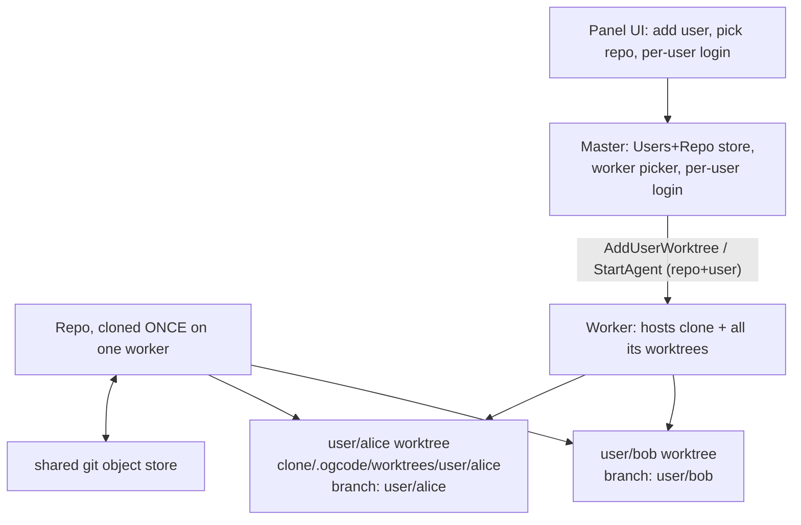

# Multi-User Repos Plan (one clone, worktree-per-user isolation)

Status: **Phases 0–3 implemented (worker + master + console), Phase 4 lifecycle pending** — the
assignment flow (assign → provision → scoped login → logical-targeting session) is live and
test-covered on both sides; merge/deprovision lifecycle (Phase 4) remains.
Based on `REMOTE_AGENT_WORKERS_PLAN.md` (already implemented). Grounding audit done 2026-09-11;
every cited file/line verified.

## Problem

Today the control plane lets an *operator* attach to any worker and start a session in any of
that worker's pre-configured workspaces. There is no notion of **users**, and **repos are
re-cloned per assignment**. This plan adds an enterprise multi-user model:

- Create many users, each with their own login credential.
- Assign each user a **repository**.
- **Clone once** per repo, on one auto-chosen worker; every user of that repo works in their own
  **git worktree** off that single clone.
- Isolation by construction: users can't touch `main` or each other's worktree/branch.
- Per-user panel access: a user sees only their own repo's worktree and their own sessions.

## Design summary

A **repo** is cloned exactly once on exactly one worker (the worker that has enough free space).
Each user assigned to that repo gets a git worktree — branch `user/<name>` checked out at
`<cloneDir>/.ogcode/worktrees/user/<name>`. `gitWorktrees()` (`internal/worker/workspaces.go:51-66`)
already auto-discovers worktrees under a configured root, so each user worktree shows up in
`ListWorkspaces` with **zero enumeration changes**. `envs` (`worker.go:81`) is keyed by directory,
so each user's worktree dir gets its own hosting env automatically.



---

## Two decisions confirmed by the developer

1. **Per-user branch** (`user/<name>`) — merge-back and review stay possible. Not detached.
2. **Auto-clone** — the master picks the worker automatically (by free space) and the worker
   clones on demand. No pre-provisioning.

## Flow + constraint confirmed by the developer (2026-09-12)

- **The worktree is created at user-assignment time.** The admin assigns a user to a
  repository; behind the scenes the worker clones the repo once and creates that user's
  worktree (Phase 0's `EnsureRepo` + `EnsureUserWorktree`), the user is assigned to that
  worktree, and an ogcode session then starts on it. **Assignment is the provisioning
  moment** — not the first session (the `AddUserWorktree` command runs eagerly; `startAgent`'s
  ensure calls are only an idempotent backstop).
- **Git is mandatory on the worker.** Clone + worktree creation are worker-side git
  operations (the master never runs git); without git on the worker host this flow does not
  work. When Phase 0 lands, the worker should detect a missing `git` early and say so
  plainly — hosting pre-existing directories works without git, but assignment (clone +
  worktree provisioning) does not.
- **Post-containment grounding note:** clones must land under a configured `--workspace`
  root. The workspace containment shipped 2026-09-12 (`Worker.workspaceAllowed`) refuses any
  hosted directory outside the worker's registration-time roots, so the plan's default
  `RepoRoot = ~/.ogcode/repos` works **only** when the operator passes it as a `--workspace`
  — treat that as required, not merely "works best".

---

## Phase 0 — mechanism: `EnsureRepo` + `EnsureUserWorktree` (worker, ogcode repo)

New file `internal/worker/repos.go`, mirroring `CreateTaskWorktree` (`internal/git/git.go:26-68`).
Both should live in the `internal/worker` package and shell out to the same `runGit` helpers in
`internal/worker/workspaces.go` (add `runGit`/`runGitOutput` there, or reuse via a tiny local
helper — do NOT import `internal/git` into `internal/worker`; keep the package boundary).

### `EnsureRepo(ctx, repoURL string) (dir string, err error)`

- Decide the clone home: `w.opts.Workspaces[0]` (the first configured root) or a new
  `worker.Options.RepoRoot` field (default `~/.ogcode/repos`). Clones live **inside** a
  configured root so `discoverWorkspaces` picks up their worktrees. **Decision**: default
  `RepoRoot = filepath.Join(os.UserHomeDir(), ".ogcode", "repos")` but document that it works
  best when the operator passes a `--workspace` pointing there.
- Path = `<RepoRoot>/<safe(repoURL)>` where `safe()` slugifies the URL (reuse the
  `Slugify` pattern; strip scheme/`.git`). Use `internal/git.Slugify`-style logic but keep it in
  `internal/worker` to avoid the cross-package import.
- If the dir exists and `git.IsRepo`-equivalent (`git -C dir rev-parse --is-inside-work-tree`)
  → return it (no re-clone).
- Else `git clone` (normal clone, not `--bare` — git worktrees can't attach to a bare repo).
  The main checkout is disposable; worktrees attach to it.
- The clone dir must sit under a worker `Workspaces` root so `gitWorktrees` discovers its
  worktrees (see discovery note in Phase 2).
- **Idempotent + concurrency-safe**: guard with a package-level `sync.Mutex` (or `w.cloneMu`)
  so two simultaneous `StartAgent`s for the same repo don't double-clone.

### `EnsureUserWorktree(repoDir, userName string) (branch, path string, err error)`

Near-copy of `CreateTaskWorktree` with:
- `branchName = "user/" + userName`
- `worktreeDir = filepath.Join(repoDir, ".ogcode", "worktrees", branchName)`
- `ensureRepoHasCommits` equivalent (the `internal/git` one; replicate the initial-commit
  creation).
- Branch creation from the repo's **default branch** (not HEAD): resolve with
  `git symbolic-ref refs/remotes/origin/HEAD` or `git rev-parse --abbrev-ref origin/HEAD`
  (fall back to `master`, then `main`).
- "already exists" tolerated on both `branch` and `worktree add`; stale entries pruned via
  `git worktree prune` before the retry (exactly as `CreateTaskWorktree:55-61`).
- Local identity configured on the worktree: `git config user.name <userName>` and
  `git config user.email <userName>@ogcode.local` — the worktree's own config (not global).
- Return the worktree path + branch.

### Tests
- `internal/worker/repos_test.go`, reusing the `workspaces_test.go` temp-dir + created-repo
  pattern (`git init` + initial commit). Run under `-race` (matches existing coverage of the
  worktree helpers). Assert: clone-once (second call returns same dir, no re-clone), branch
  name, "already exists" tolerance, and the worktree shows up in `discoverWorkspaces([]root)`.

---

## Phase 1 — proto surface (`controlplane/proto/controlplane/v1/controlplane.proto`)

### New messages

```proto
message RepoInfo {
  string name = 1;        // logical repo name (e.g. "shop")
  string url  = 2;        // clone URL
  string worker_id = 3;   // worker holding the single clone
}

message User {
  string id        = 1;
  string name      = 2;
  string repo_name = 3;   // which repo this user is assigned to
}

message AddUserWorktree {
  string repo_url = 1;
  string user_name = 2;
}
// worker replies to AddUserWorktree; result ok + no payload.

message ListRepos {}        // worker -> its managed clones (for panel)
// reply carries repeated RepoInfo in CommandResult.workspaces? NO — CommandResult is
// Workspace-typed. Add a `repeated RepoInfo repos = 5` to CommandResult.
```

### Envelope additions
- `MasterToWorker` gains a `AddUserWorktree add_user_worktree = 10;` oneof member.
- `CommandResult` gains `repeated RepoInfo repos = 5;` (only populated by a ListRepos reply).

### `StartAgent` gains logical targeting
Replace the raw `workspace` absolute path with a repo+user pair (keep `workspace` for
back-compat during the transition, then drop it):

```proto
message StartAgent {
  string session_id  = 1;
  string repo_url    = 8;   // logical clone source
  string user_name   = 9;   // which user's worktree
  // workspace/ref/agent_name/prompt/viewport remain as today (workspace becomes derived).
  ...
}
```

The master never sends absolute worktree paths — it sends the logical `(repo_url, user_name)`
pair and lets the worker resolve.

### Regenerate
`buf generate` (toolchain in `~/go/bin`) from `controlplane/` — see the Stable-Worker-ID note in
MEMORY.md. `controlplane` is a **nested module**; generate inside it, commit both the `.proto`
and the regenerated `gen/`.

---

## Phase 2 — worker `startAgent` resolution

Change `startAgent` (`internal/worker/worker.go:273-308`):

1. If `c.GetRepoUrl() != ""` and `c.GetUserName() != ""`:
   - `repoDir, err := w.EnsureRepo(ctx, c.GetRepoUrl())`
   - `branch, dir, err := w.EnsureUserWorktree(repoDir, c.GetUserName())`
   - `dir` is now the hosting directory.
2. Else fall back to the legacy `c.GetWorkspace()` path (existing behavior) until callers migrate.
3. Everything downstream is unchanged:
   - `envFor(dir)` (`worker.go:310-324`) keys on the worktree dir → its own env/DB/relay.
   - `createSessionRows` (`session.go:66-107`) persists the worktree dir as the project.
   - `RunLoop` runs in the worktree.
4. **Discovery**: because the clone root is under a `Workspaces` root, `discoverWorkspaces`
   (`workspaces.go:17-47`) shows every user worktree with its branch (via `gitWorktrees` +
   `gitBranch`). No change to discovery code itself. **Verify in a test** that
   `discoverWorkspaces([]string{repoRoot})` lists a freshly created user worktree.

### `handleCommand` wiring (`worker.go:237-271`)
- `case *cpv1.MasterToWorker_AddUserWorktree:` → run `EnsureRepo`+`EnsureUserWorktree`
  eagerly (so the worktree exists before the first session), reply `ok`/`error`.
- `case *cpv1.MasterToWorker_ListRepos:` → reply with the worker's managed clones (tracked in
  local state set by `EnsureRepo`).

### Worker local repo bookkeeping
- Add `repos map[string]string` (repoURL → cloneDir) + mutex on `Worker` (`worker.go:65-86`),
  filled by `EnsureRepo`. Not persisted — re-discovered from disk at boot by scanning the
  repo root.

---

## Phase 3 — master registry + RPCs (`controlplane/internal`)

### New store: `controlplane/internal/users` (or extend `internal/registry`)

Following the "separate store, not a config edit" decision from the earlier review:

- `controlplane/internal/master/server.go:35-46` (Server) holds the registry. Add a
  `users Store` field; the store lives in a new package or a new file `InternalStore` next to
  `registry.go`.
- Tables (in-memory, mirroring `registry.Registry`'s style — mutex-protected maps; persist only
  if restarts must survive, otherwise re-seed from the worker's `ListRepos` at boot):
  - `Repo { name, url, workerID, cloneDir }` — which worker holds the single clone.
  - `User { id, name, repoName, passwordHash }` — per-user credential.
- The existing single `OperatorPassword` (`config.go:46`) becomes the **admin** password
  (can add users); each user has their own credential in the new store.
- Password hashing: bcrypt (`golang.org/x/crypto/bcrypt`), consistent with how ogcode stores
  secrets elsewhere.

### New master RPC behavior

- **Add user (admin)**:
  1. Validate the repo has (or can get) a registered worker with free space.
  2. Mint user id + credential, store them.
  3. `s.Call(workerID, AddUserWorktree{repoURL, userName})` so the worktree is created eagerly.
  4. Record `Repo.name → workerID`.
- **Worker selection (auto)**: new helper `pickWorker(ctx, repoURL) (workerID string, err)`:
  - Prefer a worker already holding the clone (`Repo.workerID`).
  - Else query live workers' free space: reuse the capability field already reported at
    `Register` (`capabilities`, `controlplane.proto:69`) and/or add a `Stats` command. **Decision**:
    add a lightweight `Stats` command (`MasterToWorker` + `CommandResult`) where the worker
    reports `free_bytes` (via `statvfs`/`syscall.Statfs` on the clone root). `pickWorker`
    selects the online worker with the most free space (and a recorded clone wins).
  - On failure (no worker online / no space): surface a clear admin error.
- **`StartRemoteAgent`** (`server.go:292-316`): callers now pass `(repo_name, user_name)` in
  `StartSpec` (`server.go:318-326`); the server looks up `User.repoName`, then
  `Repo.workerID`, and routes `StartAgent{repo_url, user_name, ...}` there. Session is minted
  and routed exactly as today (`s.reg.RouteSession(sessionID, workerID)`).

### Per-user login & session scoping (Phase 3 panel)
- Replace the single-cookie `OperatorPassword` gate (`auth.go:16-37`) with a login that checks
  **both** the admin password and the per-user store. Keep the session cookie but bind it to a
  `user` identity.
- The panel (`panel.go`, the apex console + worker UI proxy in `tunnel.go:101-139`) filters
  every view by the logged-in user: they see only their repo's worktree/branches and **only
  their own sessions**. Session scoping is `WHERE user = <who>` on panel reads — the master
  already owns routing via `registry.RouteSession`/`WorkerForSession`
  (`registry.go:233-253`), so add a `user` to the routed-session record.

---

## Phase 4 — lifecycle

- **Worktree removal**: `RemoveTaskWorktree` (`internal/git/git.go:70-75`) is the template;
  add `RemoveUserWorktree` that runs on user reassignment/deletion. Keep the branch
  (`RemoveTaskWorktreeKeepBranch`, `git.go:137-143`) so work is never destroyed.
- **Branch push-back-to-main**: reuse `PushBranch` (`git.go:188-200`) + `MergeTaskBranch`
  (`git.go:106-135`) as the model for a `MergeUserBranch` admin action (approve a user's work
  into the chain/main). This is the "review then merge" story the branch decision enables.
- **Repo deprovisioning**: when the last user is removed, remove the worktrees, optionally the
  clone, and unroute sessions (`registry.UnrouteSession`).

---

## Files touched (from the grounding audit)

### ogcode repo (`internal/worker`)
| File | Change |
|------|--------|
| `internal/worker/repos.go` (new) | `EnsureRepo`, `EnsureUserWorktree`, `safeRepoName`, local `runGit` |
| `internal/worker/repos_test.go` (new) | clone-once, worktree, discovery, `-race` |
| `internal/worker/worker.go` | `Options.RepoRoot`, `repos` map+mutex, `startAgent` resolution (273-308), `handleCommand` cases (237-271), `Stats`/`ListRepos`/`AddUserWorktree` handlers |
| `internal/worker/worker.go` (Options) | add `RepoRoot` field (40-63) |

### controlplane (nested module)
| File | Change |
|------|--------|
| `controlplane/proto/controlplane/v1/controlplane.proto` | `User`/`RepoInfo`/`AddUserWorktree`/`ListRepos`/`Stats`, `StartAgent` + repo_name/user_name, `CommandResult.repos`, `MasterToWorker` oneof |
| `controlplane/internal/registry/registry.go` | routed-session `user` field, `Repo→worker` index helpers |
| `controlplane/internal/master/server.go` | `pickWorker` (auto by free space), `AddUser` RPC, `StartRemoteAgent` (292-316) logical routing, `Stats` command, `StartSpec` (318-326) fields |
| `controlplane/internal/master/{panel,auth}.go` | per-user login + per-user session/repo filtering |
| `controlplane/internal/config/config.go` | (optional) repo-root/repo default, admin-vs-user clarifier |
| `controlplane/internal/master/*_test.go` | routing, picker, AddUser, session-scoping tests |

> `internal/git/git.go` is **NOT** imported by `internal/worker`; worktree helpers are duplicated
> into `internal/worker/repos.go` to keep the package boundary. `internal/git` remains the
> template/reference implementation.

---

## Deliberately NOT built (Phase 0–3)

- **Merge/push-back-to-main** is Phase 4, not part of v1 of this feature.
- **Persistent user store across restarts** — v1 is in-memory like `registry`; re-seeded from
  the worker's `ListRepos` at boot. Persist (JSON/DB) only if the requirement appears.
- **Git remote hosting / PR against a shared upstream** — worktrees of a single clone are self-
  contained; pushing to an external origin is the admin's job (Phase 4).

---

## Open risks

- **Multi-worker clones**: if the same repo is ever cloned on two workers (e.g. because the
  recording worker is down and another auto-clone happens), users' branches diverge. Mitigation:
  `Repo.workerID` is authoritative and `pickWorker` prefers it; if it's dead, surface an admin
  error rather than silently cloning elsewhere (or add a "forced rehome" admin action).
- **Same-file mutation across user worktrees** is impossible by construction (different dirs),
  mirroring the BreakdownAgent rule in `agent.go:234`. The process-local pathlock
  (`internal/tool/pathlock.go`) covers intra-worktree contention only.
- **`env` per user worktree**: each worktree gets its own `ogcode.db`, provider keys resolved via
  the shared global `config.db` (`env.go:56`) — fine, but MCP subprocesses spawn once per worktree
  dir (`buildEnv:96-108`). Acceptable; note it if perf matters.
