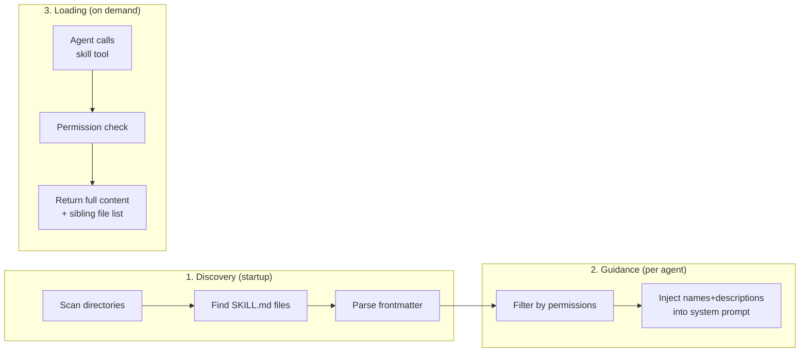

# Skill Feature — Research & Implementation Guide

> **Purpose:** This document is a handover for the implementing agent. It captures how OpenCode (a comparable project) implements its "skill" feature, distills the design into a portable model, and outlines a concrete implementation plan for ogcode. The implementing agent should read this top-to-bottom, then map the plan onto ogcode's existing conventions (`internal/tool/tool.go` Registry, `internal/agent/prompt_builder.go`, config loading) before writing code.
>
> **Scope:** Research-only on the OpenCode side. The ogcode-specific sections are a proposed plan, not verified against ogcode's current internals. The implementing agent MUST read the relevant ogcode files first (listed in §5) to confirm the mappings are accurate.

---

## 1. What is a "Skill"?

A **skill** is a reusable, on-demand set of instructions bundled as a `SKILL.md` file (with YAML frontmatter) inside a named directory. The key idea: the agent does **not** see the skill body by default. It only sees the skill's **name and description** in its system prompt, and must call a `skill` tool to pull the full content into context when a task matches.

This is a **lazy-loading** pattern:

- The agent always sees the **menu** (cheap — just names + descriptions).
- It only pays the token cost of the full skill body when it actually needs it.

### Why this matters

If you dumped every skill's full body into the system prompt, you'd waste context on skills the agent never uses. By listing only names + descriptions and loading the body via a tool call, you keep the prompt small and let the agent decide which skills are relevant to the current task.

---

## 2. How OpenCode Implements It — The Three-Part Architecture



The design has three deliberately separated concerns: **Discovery**, **Guidance**, and **Loading**. Each is described below.

### 2.1 Discovery — finding SKILL.md files at startup

At startup, OpenCode scans these locations for `SKILL.md` files (and `{skill,skills}/**/SKILL.md`):

| Scope | Locations |
|-------|-----------|
| **Project config** | `.opencode/skills/<name>/SKILL.md` (walks up the dir tree to git root) |
| **Global config** | `~/.config/opencode/skills/<name>/SKILL.md` |
| **Claude-compatible** | `.claude/skills/<name>/SKILL.md` (project + `~/.claude/`) |
| **Agent-compatible** | `.agents/skills/<name>/SKILL.md` (project + `~/.agents/`) |
| **Config-defined paths** | `skills.paths[]` in config — local dirs |
| **Remote URLs** | `skills.urls[]` in config — fetched from an `index.json` manifest |

**Remote skills:** For remote URLs, OpenCode fetches an `index.json` describing skills and their files, downloads them to a cache dir (`~/.cache/opencode/skills/`), with version-based refresh logic (staging dir + atomic rename to avoid partial states).

**Parsing:** Each discovered `SKILL.md` is parsed:
- YAML frontmatter provides `name` (required) and `description` (optional).
- The markdown body (everything after the frontmatter) becomes the skill's `content`.

The parsed skill is an object like `{ name, description, location (dir path), content }`.

### 2.2 Guidance — telling the agent what skills exist

The **guidance layer** renders an XML block into the system prompt. This is a "Context Source" — a pluggable contributor to the system prompt. The rendered output looks like:

```xml
Skills provide specialized instructions and workflows for specific tasks.
Use the skill tool to load a skill when a task matches its description.
<available_skills>
  <skill>
    <name>git-release</name>
    <description>Create consistent releases and changelogs</description>
  </skill>
  <skill>
    <name>rtl-aware-development</name>
    <description>OpenCode Desktop should be RTL-aware...</description>
  </skill>
</available_skills>
```

**Permission filtering:** This list is filtered **per agent** based on permission rules: `Permission.evaluate("skill", skill.name, agent.permission)`.
- `deny` skills are **hidden entirely** from the prompt.
- `ask` skills are still listed (the agent can call the tool; the user is prompted at call time).
- `allow` skills are listed and load immediately.

This guidance is re-rendered when the agent changes mid-conversation (it's a "Mid-Conversation System Message").

### 2.3 The `skill` tool — loading a skill on demand

When the agent decides a task matches a skill, it calls `skill({ name: "git-release" })`. The tool:

1. Looks up the skill by name from the current skill list (the registry).
2. Runs a permission assertion (`permission.assert` with `action: "skill"`, `resources: [skill.name]`) — this triggers the user approval prompt for `ask`-permission skills.
3. Globs the skill's directory for up to **10 sibling files** (excluding `SKILL.md`), so the agent knows what other files the skill ships with (scripts, references, etc.).
4. Returns wrapped output to the model:

```xml
<skill_content name="git-release">
# Skill: git-release

<full markdown body>

Base directory for this skill: /path/to/skills/git-release
Relative paths in this skill (e.g., scripts/, reference/) are relative to this base directory.
Note: file list is sampled.

<skill_files>
<file>/path/to/skills/git-release/scripts/release.sh</file>
<file>/path/to/skills/git-release/CHANGELOG.md</file>
</skill_files>
</skill_content>
```

The skill body + its sibling file paths are now in context. The agent can read those files with other tools (read, bash, etc.).

---

## 3. SKILL.md Format

```markdown
---
name: git-release
description: Create consistent releases and changelogs
license: MIT
compatibility: opencode
metadata:
  audience: maintainers
  workflow: github
---

## What I do
- Draft release notes from merged PRs
- Bump version across the 4 files (6 entries) that must stay in sync
- Create and push the git tag

## How to use me
1. Call me when the user asks for a release
2. I'll read the RELEASE_NOTES.md and recent commits
...
```

### Field validation (OpenCode's rules)

| Field | Rules |
|-------|-------|
| `name` | **Required.** 1–64 chars. Lowercase alphanumeric with single hyphen separators. Must match the directory name. Regex: `^[a-z0-9]+(-[a-z0-9]+)*$` |
| `description` | Optional but strongly recommended. 1–1024 chars. |
| `license` | Optional. SPDX identifier or free text. |
| `compatibility` | Optional. Which tool the skill targets (e.g. `opencode`). |
| `metadata` | Optional. Free-form YAML map for arbitrary metadata. |

The markdown body (after the `---` frontmatter delimiter) is the skill content — the actual instructions the agent loads.

---

## 4. Permissions (config-driven)

In `opencode.json`, pattern-based permission rules control skill access:

```json
{
  "permission": {
    "skill": {
      "*": "allow",
      "pr-review": "allow",
      "internal-*": "deny",
      "experimental-*": "ask"
    }
  }
}
```

| Effect | Behavior |
|--------|----------|
| `allow` | Listed in prompt, loads immediately when the tool is called |
| `deny` | Hidden from agent entirely; access rejected if somehow called |
| `ask` | Listed in prompt, user prompted before loading (approval flow) |

**Wildcards** are supported: `internal-*` matches `internal-docs`, `experimental-*` matches `experimental-thing`, `*` matches everything.

Permission rules are evaluated in order; the first matching pattern wins (the implementing agent should confirm this order/precedence against ogcode's existing permission system, if one exists).

---

## 5. Built-in / Embedded Skills

OpenCode ships a built-in skill (`customize-opencode`) embedded as a markdown string directly in the source (not a file on disk). It is registered **before** disk discovery so that a user's disk version with the same name can override it. This is the override priority:

1. Disk-discovered skills (project, global, etc.)
2. Built-in embedded skills (registered first, overridable)

If a user puts a `customize-opencode/SKILL.md` in their project skills dir, theirs wins.

---

## 6. OpenCode v2 Architecture Note (the newer design)

OpenCode is mid-migration from v1 to v2. The **v2 design** treats skills through a "Source" abstraction — three source types:

| Source | Description |
|--------|-------------|
| `DirectorySource` | Local filesystem path |
| `UrlSource` | Remote manifest (`index.json`) |
| `EmbeddedSource` | Built-in string content |

Sources are composed via a plugin (`config-skill` plugin builds directory sources from config locations). Skills are loaded lazily and cached by source key. The v2 guidance is a "System Context" entry that renders the same XML `<available_skills>` block and supports live updates when the available set changes mid-conversation.

> **For ogcode:** Start with the v1 model (DirectorySource + EmbeddedSource). The v2 Source abstraction is an internal refactor of OpenCode's and is not essential to the feature. You can introduce it later if the number of source types grows.

---

## 7. Implementation Plan for ogcode

> **IMPORTANT:** The implementing agent must read the ogcode files listed in §7.1 before writing code, to confirm the package structure, the tool Registry, the prompt builder, and the config system. The mappings below are a proposed starting point, not verified.

### 7.1 Files to read first (ogcode)

| File | Why |
|------|-----|
| `internal/tool/tool.go` | The tool `Registry`, `Registry.ForAgent`, and how tools are registered. The skill tool must fit this. |
| `internal/tool/*.go` | Existing tool implementations to match the `Tool` interface (Description, Execute, etc.) and error/result conventions. |
| `internal/agent/prompt_builder.go` | Where system prompt sections are built. The skill guidance block goes here. Read how `osEnvPrompt()`, `viewportPrompt()`, `latexEnv` sections are injected for the pattern. |
| `internal/agent/loop.go` | `buildSystemPrompt` / `buildSystemPromptEntries` / `staticSystemPrompt` — how entries are ordered. **Entry [0] must stay byte-identical for prompt caching** — skill guidance must NOT go in the static block; it belongs in a later entry. |
| `internal/agent/agent.go` | Per-agent prompt definitions and tool lists. A skill tool must only reach agents that hold it (see AGENT.md rule). |
| `internal/agent/tool_reachability_test.go` | `mandatoryPromptTools` — if the skill tool is named in a prompt section, its id must be added here. |
| Config loading (find via grep for config struct) | How ogcode loads config — where to add `skills.paths`, `skills.permissions`. |

### 7.2 Proposed ogcode package structure

```
internal/skill/
├── skill.go          # Skill type, parsing, validation
├── discover.go       # Directory scanning + SKILL.md parsing
├── registry.go       # Registry: name -> Skill, built-in + discovered
└── registry_test.go   # Tests

internal/tool/
└── skill.go          # The `skill` tool (calls registry, permission check, returns body + files)

internal/agent/
└── prompt_builder.go # New skillGuidancePrompt() section
```

### 7.3 Step-by-step

**Step 1 — The `Skill` type and parsing (`internal/skill/skill.go`)**

```go
type Skill struct {
    Name        string // from frontmatter, validated
    Description string // from frontmatter, optional
    Dir         string // absolute path to the skill's directory
    Content     string // markdown body (after frontmatter)
}
```

- Parse YAML frontmatter (use whatever YAML lib ogcode already depends on — grep for `gopkg.in/yaml` or `yaml.v3` in go.mod).
- Validate `name`: regex `^[a-z0-9]+(-[a-z0-9]+)*$`, 1–64 chars.
- `description`: 1–1024 chars if present.
- The `name` should match the directory name (warn or reject on mismatch — pick a convention).

**Step 2 — Discovery (`internal/skill/discover.go`)**

Scan these dirs (adapt to ogcode's own config dir naming — ogcode uses `.ogcode/` for runtime state, so skills should probably live in a different location to avoid confusion; candidate: `.ogcode/skills/` for project, `~/.config/ogcode/skills/` or `~/.ogcode/skills/` for global — confirm the convention with the developer):

- Project: `.ogcode/skills/<name>/SKILL.md` (walk up to git root)
- Global: `~/.ogcode/skills/<name>/SKILL.md` (or `~/.config/ogcode/skills/` — pick one)
- Config-defined: `skills.paths[]` in config

> **Decide with the developer:** Do NOT use `.ogcode/` for skills if `.ogcode/` is runtime-only state (AGENT.md says ".ogcode/ is runtime state, not source — do not edit it"). Skills are source files the user authors, so they likely belong in a user-visible config dir, not the runtime state dir. This is an open question for the implementing agent to confirm.

**Step 3 — Registry (`internal/skill/registry.go`)**

```go
type Registry struct {
    skills map[string]Skill
}

func NewRegistry() *Registry
func (r *Registry) Register(s Skill) error    // name collision -> error or override
func (r *Registry) Get(name string) (Skill, bool)
func (r *Registry) List() []Skill             // sorted by name
func (r *Registry) LoadFromDirs(dirs []string) error  // discover + parse
```

- Built-in (embedded) skills registered first, then disk discovery overrides by name.

**Step 4 — The `skill` tool (`internal/tool/skill.go`)**

Implement the `Tool` interface (read `internal/tool/tool.go` to get the exact interface):

- `ID()` / `Name()` → `"skill"`
- `Description()` → explains: "Load a skill's full instructions by name. Skills are listed in your system prompt. Call this when a task matches a skill's description."
- Parameters: `{ name: string }` (required).
- `Execute`:
  1. Look up skill by name in the registry. If not found, return an error result.
  2. (Optional, if permissions are implemented) Check permission for `skill` action + skill name.
  3. Glob the skill's `Dir` for up to 10 sibling files (excluding `SKILL.md`).
  4. Return the wrapped XML block (see §2.3 for the exact format).

Register the tool in the agent's `Tools` list (in `internal/agent/agent.go`) for the agents that should have it.

**Step 5 — Guidance in the system prompt (`internal/agent/prompt_builder.go`)**

Add a `skillGuidancePrompt()` function that renders:

```xml
Skills provide specialized instructions and workflows for specific tasks.
Use the skill tool to load a skill when a task matches its description.
<available_skills>
  <skill>
    <name>{name}</name>
    <description>{description}</description>
  </skill>
  ...
</available_skills>
```

**Critical prompt-cache constraint** (from AGENT.md):
- Entry [0] of the system prompt must stay **byte-identical** for the whole session. The skill list can change if skills are added/removed, so skill guidance must NOT be in the static block.
- Put skill guidance in a **later system prompt entry** (like the date/viewport entries).
- If the skill set is static for the session, it could go in the static block — but safer to keep it dynamic. Confirm with the developer.

**Step 6 — `tool_reachability_test.go`**

If the skill tool id is named in any prompt section, add it to `mandatoryPromptTools` in `internal/agent/tool_reachability_test.go` (per AGENT.md invariant). This pins the invariant that a prompt section naming a tool only reaches agents that hold it.

**Step 7 — Config (optional, phase 2)**

Add to ogcode's config struct:
```go
type SkillsConfig struct {
    Paths       []string          `json:"paths"`       // extra skill dirs
    Permissions map[string]string `json:"permissions"` // pattern -> allow|deny|ask
}
```

Permissions can be a phase-2 feature. For phase 1, all discovered skills are `allow` (listed + load immediately).

### 7.4 Phasing

| Phase | Scope |
|-------|-------|
| **1 (MVP)** | Skill type, parsing, directory discovery (project + global), registry, `skill` tool, guidance prompt section. No permissions, no remote URLs. |
| **2** | Config-defined paths, permission rules (allow/deny/ask), wildcard patterns. |
| **3** | Remote URL sources (`index.json` manifest + cache), built-in embedded skills. |

---

## 8. Key Design Decisions (from OpenCode, to preserve)

1. **Lazy loading.** The agent sees names + descriptions only; the body is loaded via a tool call. Do not dump skill bodies into the system prompt.
2. **Permission filtering per agent.** Denied skills are hidden from the prompt; `ask` skills prompt the user at tool-call time.
3. **Sibling file awareness.** The skill tool returns the skill body AND a list of sibling files (up to 10), so the agent knows what else the skill ships with and can read them.
4. **Override priority.** Disk skills override built-in skills of the same name.
5. **Name == directory name.** The frontmatter `name` must match the directory name. This keeps discovery and lookup consistent.
6. **Prompt-cache safety.** The guidance block must live in a dynamic (non-static) system prompt entry so it doesn't break Anthropic prompt caching (the static block must be byte-identical all session).

---

## 9. Open Questions for the Developer (resolve before implementing)

1. **Skill directory location.** `.ogcode/` is runtime state (not source). Where should project skills live? Candidates: `.ogcode/skills/`, `./skills/`, `~/.config/ogcode/skills/`. **This must be decided** — skills are user-authored source, so they probably should NOT be in the runtime-state `.ogcode/` dir.
2. **Which agents get the skill tool?** The main coding agent for sure. Do plan-mode, sub-agents, or the deep-search agent also get it?
3. **Permissions in phase 1?** Or skip for the MVP (all discovered skills = allow)?
4. **Remote skill URLs** — needed, or local-only for now?
5. **Built-in embedded skills** — does ogcode want to ship any built-in skills?

---

## 10. Reference: OpenCode file locations (for cross-checking)

These are the OpenCode source files the research was based on (not in ogcode — for reference only):

| Concern | OpenCode file |
|---------|---------------|
| Skill type + parsing | `packages/core/src/skill/skill.ts` |
| Discovery | `packages/core/src/skill/discover.ts` |
| Guidance (system prompt) | `packages/core/src/skill/guidance.ts` |
| The `skill` tool | `packages/opencode/src/tool/skill.ts` |
| v2 Source abstraction | `packages/core/src/skill.ts` |
| Config (skills.paths, skills.urls, permissions) | `packages/core/src/config/config.ts` |
| Permission evaluation | `packages/core/src/permission/permission.ts` |

---

## Summary

The skill feature is a **lazy-loaded instruction system** with three layers:

1. **Discovery** — scan dirs for `SKILL.md`, parse frontmatter, build a registry.
2. **Guidance** — inject a cheap, permission-filtered list of skill names + descriptions into the system prompt (in a dynamic, cache-safe entry).
3. **Loading** — a `skill` tool the agent calls to pull the full body + sibling file list into context, gated by optional permissions.

Start with phase 1 (MVP): local discovery + registry + tool + guidance, no permissions or remote URLs. Read ogcode's `internal/tool/tool.go`, `internal/agent/prompt_builder.go`, `internal/agent/loop.go`, and config loading before writing code. Resolve the open questions in §9 with the developer first.