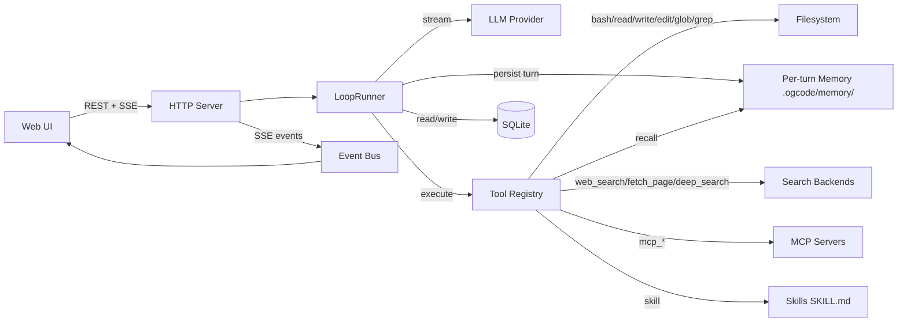

Ogcode is an **agent operating environment** for software work. Most AI coding tools answer a question or complete a line; Ogcode is built to take responsibility for multi-step work — understanding a codebase, making a bounded change across files, running the project's own tests, and leaving behind evidence you can review.

If you have used an editor plugin with a chat panel, the difference is the shape of the loop. Ogcode gives an agent a workspace, a set of tools, a budget, and a stopping condition, then lets it run until the work is done or it needs you.

## What it is

- **Open source and self-hostable.** One Go binary with the web UI embedded — nothing else to serve, no database to provision.
- **Agentic, not autocomplete.** The agent plans, edits, executes and verifies, rather than proposing a diff you paste in yourself.
- **Browser-native.** You work in a web UI, not inside a particular editor.
- **Model-agnostic.** Anthropic, OpenAI, OpenRouter, a local Ollama endpoint, or the OG Lab subscription (OGX).
- **Built for long-running work.** Sessions survive restarts, context is compacted rather than lost, and memory carries from one turn to the next.
- **Git-native.** Plan Mode breaks a feature into tasks, runs each in its own worktree, and opens pull requests.
- **Permission-aware.** Every consequential tool call is gated — ask, auto-approve, or refuse by an explicit rule.
- **Growing into a general computer agent.** Code is the current focus; the same tool-and-permission model reaches documents, rich output, and local services.

## What it runs on

Ogcode is a single static binary. It contains the HTTP server, the agent loop, the tool registry and the compiled web UI.

- **One LLM credential.** Set `ANTHROPIC_API_KEY`, `OPENAI_API_KEY` or `OPENROUTER_API_KEY`, point `OLLAMA_BASE_URL` at a local server, or connect an OGX plan from the settings screen. See [Install](/docs/install/) for the full list.
- **Two SQLite databases.** A workspace database at `.ogcode/ogcode.db` and a global config database at `~/.ogcode/config.db`. Both are created on first run — you never set them up by hand.
- **Native libraries for the optional features.** PDF and document reading uses MuPDF, and code outlines use tree-sitter. These are compiled into release builds; a build from source needs `CGO_ENABLED=1`.

There is no message queue, no external cache, and no service to run alongside it. If the binary runs, the whole thing runs.

## How the pieces fit

An HTTP request from the browser reaches the server, which hands the turn to the agent loop. The loop streams from the model, executes any tool calls it receives, persists everything, and publishes events back to the UI over Server-Sent Events.

The diagram is a map, not a contract — the [Architecture & configuration](/docs/architecture/) reference walks each piece in full.

## Where to go next

1. [Install](/docs/install/) — get the binary onto macOS, Linux or Windows, or run it in Docker.
2. [Quick start](/docs/quick-start/) — go from a fresh install to an agent editing files in your repo.
3. [Core concepts](/docs/core-concepts/) — sessions, agents, modes, context and memory, the mental model behind everything else.
