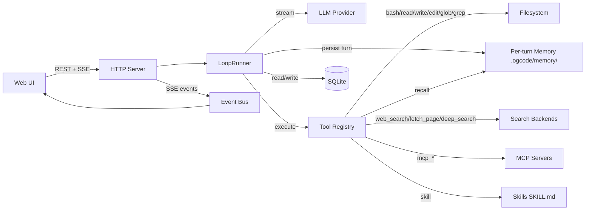
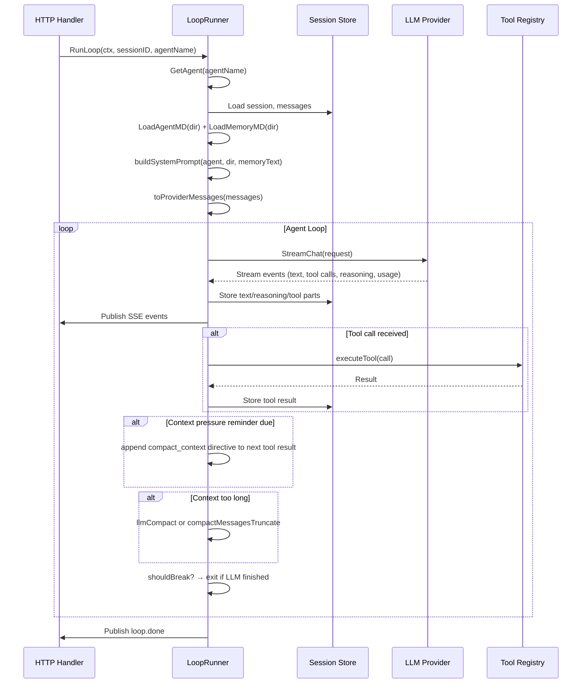
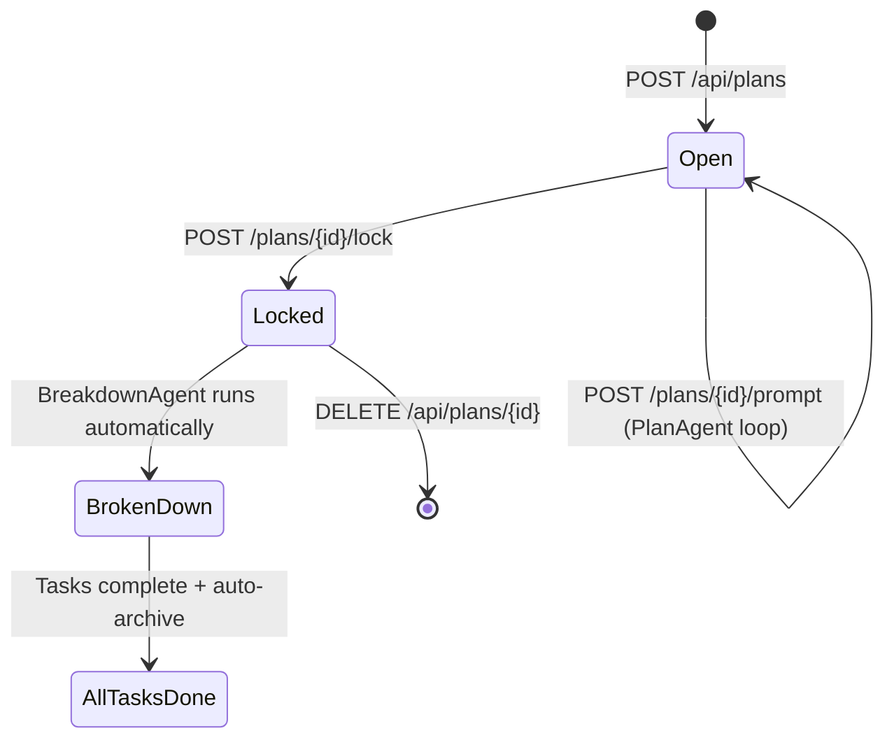
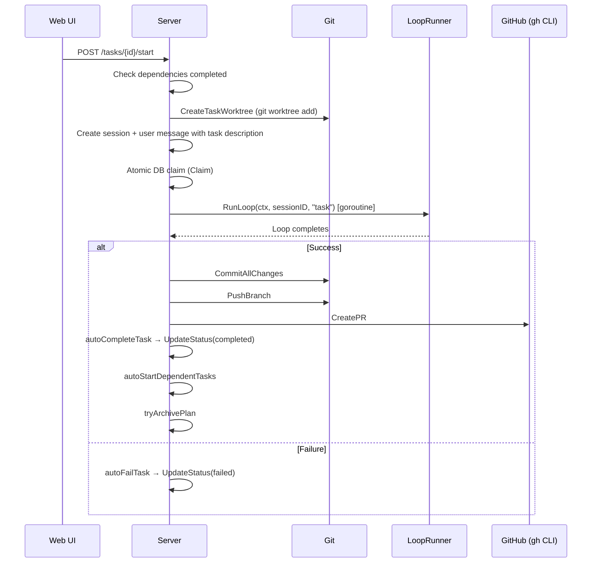
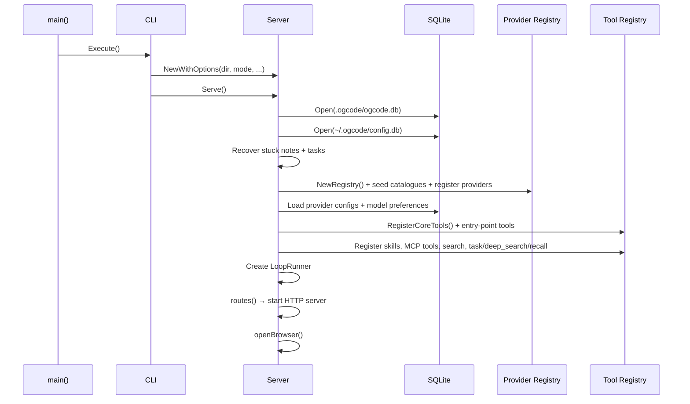

# Ogcode — Documentation Outline

> Architecture and configuration reference for the ogcode codebase.
> Regenerated from codebase analysis at **v0.39.0**.

---

## 1. Overview & Quick Start

### 1.1 What is Ogcode?
- Agentic coding assistant with a web UI, written in Go (single static binary + embedded React frontend)
- **Two interactive modes**: **Build** (full read/write, the default) and **Plan** (read-only planning → task breakdown → automated PRs)
- Beyond the interactive loop: headless `run`, one-shot `index`, a **Note** system, **web search / deep research**, **skills**, **MCP** servers, local **service preview**, and a **remote-worker** control-plane client

### 1.2 Quick Start
- Installation options: `go install`, Homebrew, curl script, Docker
- First run: `ogcode` or `ogcode serve` starts on port 9595
- Required: at least one LLM credential — `ANTHROPIC_API_KEY`, `OPENAI_API_KEY`, `OPENROUTER_API_KEY`, an Ollama endpoint, or an OGX account connected through the UI
- Optional: `OGCODE_TURN_MEMORY` (per-turn markdown memory, **on by default**), `OGCODE_AUTO_INDEX` (document indexing, **on by default**)

### 1.3 Architecture at a Glance
- Single Go binary: HTTP server + embedded React frontend (`web/embed.go`)
- Two databases: workspace DB (`.ogcode/ogcode.db`) + global config DB (`~/.ogcode/config.db`)
- LLM providers: Anthropic, OpenAI, OpenRouter, Ollama, OGX
- CGO dependencies: MuPDF (PDF rendering) and tree-sitter (code outlines); the Swift grammar needs `CGO_ENABLED=1`



---

## 2. CLI & Configuration

### 2.1 Commands

| Command | Description | Flags |
|---------|-------------|-------|
| `ogcode` | Start in Build Mode (default) | `-p, --port` (default `9595`) |
| `ogcode serve` | Start the server (explicit form of the default) | `-p, --port` |
| `ogcode plan` | Start in Plan Mode | `-p, --port` |
| `ogcode index` | Scan the workspace for PDFs/DOCX and index them with semantic labels | `--model` |
| `ogcode run [prompt]` | Run a one-shot agent prompt non-interactively, printing to stdout | `-a, --agent` (default `build`), `-o, --output-format` (`text`\|`json`), `--max-turns` (default `100`), `--model` |
| `ogcode version` | Print version information | — |
| `ogcode check-updates` | Check for available updates | — |
| `ogcode worker` | Run ogcode as a remote worker for a control plane | `--master`, `--name`, `--workspace` (repeatable), `--repo-root`, `--pairing-secret-file`, `--master-ca`, `--insecure` |

Persistent flags on the root command: `--ollama-url` (overrides `OLLAMA_BASE_URL` and the config file) and `--ollama-key`.

**Entry chain.** `main.go main()` → `cli.Execute()`. `Execute()` loads a `.env` via godotenv, calls `setupLogging()`, loads the project config (`config.Load(dir).ApplyEnv()`), then runs the root command. The server path is `serveWithMode()` → port resolution via `internal/portmap` → `server.NewWithOptions()` → `srv.Serve()`.

### 2.2 Environment Variables

**Agents, memory & indexing**

| Variable | Purpose |
|----------|---------|
| `OGCODE_COMPACT_CONTEXT` | Offer the agent `compact_context`, the mid-turn tool that replaces finished context with a summary. On by default; `0`/`false`/`no`/`off` withholds it |
| `OGCODE_READ_PRESSURE_THRESHOLD_TOKENS` | Estimated tokens of file, search, and page content read in one turn before the agent is reminded that `compact_context` exists (default `40000`, clamped `[2000, 1000000]`) |
| `OGCODE_RESEND_COST_WINDOW_MULTIPLE` | Accumulated re-send cost, as a multiple of the model's context window, at which the agent is reminded to compact — every step re-sends the whole context, so a long turn keeps paying for its finished work (default `1`, clamped `[1, 1000]`) |
| `OGCODE_TURN_MEMORY` | Write a per-turn markdown summary under `.ogcode/memory/` and index it. On by default; falsey disables |
| `OGCODE_AUTO_INDEX` | Automatically index the workspace's PDFs/DOCX for `pdf_index`/`docx_index`. On by default; falsey disables |
| `OGCODE_NO_KEEP_AWAKE` | Skip the macOS power assertion held during an agent turn |

**Web search**

| Variable | Purpose |
|----------|---------|
| `OGCODE_SEARCH_ENABLED` | Enable the web-search subsystem |
| `OGCODE_SEARCH_BROWSER` | Which native engine leads: `native` (HTTP path) or `safari` (drive a real browser first) |
| `OGCODE_SEARCH_PERSONA` | Named HTTP persona for the native engine (e.g. `chrome-133-macos`) |
| `OGCODE_SEARXNG_URL` | A SearxNG instance to query ahead of the built-in engines |
| `OGCODE_SEARCH_FETCH_TOP_K` | Pages fetched per search result (default `4`, clamped `[1, 10]`) |
| `OGCODE_SEARCH_PAGE_CHARS` | Characters extracted per fetched page (default `6000`, clamped `[1000, 20000]`) |
| `TAVILY_API_KEY` | Tavily API key; overrides the key stored in the search config |

**Providers**

| Variable | Purpose |
|----------|---------|
| `ANTHROPIC_API_KEY` / `ANTHROPIC_BASE_URL` / `ANTHROPIC_MODEL` | Anthropic credential, endpoint override, default model |
| `OPENAI_API_KEY` / `OPENAI_BASE_URL` / `OPENAI_MODEL` | OpenAI credential, endpoint override, default model |
| `OPENROUTER_API_KEY` / `OPENROUTER_MODEL` | OpenRouter credential and default model |
| `OLLAMA_BASE_URL` / `OLLAMA_API_KEY` / `OLLAMA_MODEL` | Ollama endpoint, key, default model |
| `OLLAMA_FALLBACK_URLS` | Comma-separated fallback Ollama endpoints tried in order |
| `OLLAMA_CATALOG_URL` | Where to fetch the Ollama model catalogue from |
| `OLLAMA_SHOW_URL` / `OLLAMA_CLOUD_CATALOG` | Ollama `/api/show` endpoint and cloud-catalogue toggle |
| `OGX_GATEWAY_URL` | OGX gateway base URL (default `https://ogx.ogcode.xyz/v1`) |
| `OGX_CONNECT_URL` | OGX account-connect URL used by the OAuth flow |
| `OGCODE_STREAM_IDLE_TIMEOUT` | Stream idle budget before a turn is called stalled: a duration (`30m`), bare seconds (`1800`), or `off`. Overrides the per-endpoint defaults (10m local / 2m cloud) |
| `OGCODE_FORCE_IPV4` | `1`/`true`/`yes`/`on` pins IPv4, `0`/`off`/`never` keeps IPv6. Unset = automatic fallback to IPv4 after two IPv6-path failures |

**Logging**

| Variable | Purpose |
|----------|---------|
| `OGCODE_LOG_LEVEL` | `debug`, `info` (default), `warn`, `error` |
| `OGCODE_LOG_FORMAT` | `text` (default) or `json`; all logs go to stderr |

**MCP, device & preview**

| Variable | Purpose |
|----------|---------|
| `OGCODE_MCP_TOKEN_DIR` | Where MCP OAuth tokens are stored (default `~/.ogcode/mcp-tokens/`) |
| `DISPLAY` / `WAYLAND_DISPLAY` | Used to find a browser for the Safari search backend and MCP auth flows |
| `OGCODE_SCRCPY_TARGET` | Target of the `/scrcpy/*` proxy (default `http://127.0.0.1:8000`) |
| `ANDROID_HOME` / `ANDROID_SDK_ROOT` | Android SDK location for the device/scrcpy integration |

**Remote worker**

| Variable | Purpose |
|----------|---------|
| `OGCODE_PAIRING_SECRET` | Shared secret used to authenticate to the control-plane master (else `--pairing-secret-file`) |

### 2.3 Config Files (`internal/config/`)

- **Global**: `~/.config/ogcode/config.json`
- **Project**: `ogcode.json`, scoped to the repo root. `EnsureProjectFile` scaffolds it and adds it to `.gitignore`

Keys:

| Key | Shape |
|-----|-------|
| `providers` | map id → `{ baseUrl, apiKey }` |
| `skills` | `{ paths[], urls[], permissions{}, env{} }` |
| `mcp` | map name → `{ transport, command, args, env, url, headers, auth{ clientId, clientSecret, scopes, skipOAuth }, disabled }` |

`ApplyEnv` exports provider credentials and skill `env` entries into the process environment; a real environment variable always wins (`setIfUnset`).

---

## 3. Agent System

### 3.1 Agent Definitions

Each agent is a static configuration with an ID, a tool list, and a system prompt (`internal/agent/agent.go`):

| Agent | ID | Tools | Purpose |
|-------|----|-------|---------|
| **BuildAgent** | `build` | `bash, read, file_map, check_syntax, write, edit, glob, grep, memory_recall, project_memory_recall, read_pdf_page, pdf_index, read_docx_page, docx_index, codebase_map, deep_search, latex_to_pdf, view_image, task, skill, mcp_*` | Interactive full-access coding agent |
| **TaskAgent** | `task` | same as BuildAgent | Headless variant that executes one breakdown task in a disposable git worktree; treats the task spec as authoritative and requires a commit |
| **PlanAgent** | `plan` | `bash, read, file_map, glob, grep, memory_recall, project_memory_recall, read_pdf_page, pdf_index, read_docx_page, docx_index, codebase_map, deep_search, view_image, task, skill` | Read-only planning; never writes code |
| **BreakdownAgent** | `breakdown` | `bash, read, file_map, glob, grep, codebase_map, deep_search, submit_task_breakdown` | Turn a locked plan into structured tasks with dependencies |
| **NoteAgent** | `note` | `bash, read, file_map, glob, grep, deep_search, codebase_map, pdf_index, read_pdf_page, docx_index, read_docx_page` | Research a query and produce a markdown note |
| **IndexAgent** | `index` | `submit_doc_index` | Label indexed document pages |
| **SearchAgent** | `search` | `web_search, fetch_page, read, grep` | Drive a research sub-loop for `deep_search` |
| **Subagent** | `subagent` | `read, file_map, glob, grep, memory_recall, project_memory_recall, read_pdf_page, pdf_index, read_docx_page, docx_index, codebase_map, deep_search, view_image` | Read-only explorer used by the `task` tool |
| **MemoryRecallAgent** | `memory-recall` | `memory_map, file_map, read` | Read-only recall over per-turn memory |

- `GetAgent(name)` resolves by ID; an unknown name falls back to **BuildAgent**.
- `canHostPublicFiles()` and `canAskUser()` are true for the `build` agent only — they gate the `/public` + preview prompt section and the `ask_user` tool, respectively.

### 3.2 Agent Loop (`LoopRunner.RunLoop`)

The core execution engine lives in `internal/agent/loop.go`:



Key subroutines:
- **`buildSystemPrompt()`**: assembles the agent directive + AGENT.md + MEMORY.md + tool descriptions into cache-friendly system entries (entry `[0]` is byte-identical for the whole session so the provider's prompt-cache breakpoint holds)
- **`toProviderMessages()`**: converts stored session messages to provider format
- **`executeTool()`**: resolves the tool from the registry, checks the agent holds it, requests permission, and runs it
- **`shouldBreak()`**: the loop terminates when the last assistant message has no pending tool calls

### 3.3 Context Management

Ogcode reclaims context on three levels:

1. **Mid-turn `compact_context` tool** — replaces the finished part of the current turn with a summary the model writes. Offered unless `OGCODE_COMPACT_CONTEXT` is falsey.
2. **Read-pressure reminder** — a directive appended to a content-returning tool result once enough *volume* (`OGCODE_READ_PRESSURE_THRESHOLD_TOKENS`) has been read, headed **Context pressure**. It is never capped and keeps arriving until the tool is called.
3. **Re-send-cost reminder** — the same directive on a *cost* trigger headed **Re-send cost**: once the whole context has been re-sent `OGCODE_RESEND_COST_WINDOW_MULTIPLE` × the model's window. A separate, independently-armed track for long turns that read little per step.
4. **Automatic compaction** — when `isContextLengthError()` fires: **LLM compaction** (`llmCompact`, summarizes older messages) with a **truncation fallback** (`compactMessagesTruncate`); the summary is stored on the session.

### 3.4 AGENT.md & MEMORY.md Discovery

- **`LoadAgentMD(dir)`**: walks from `dir` up to the filesystem root, aggregating `AGENTS.md` and `AGENT.md` from every directory
- `AGENTS.md` is the cross-tool convention; `AGENT.md` is ogcode's own name. Within a directory `AGENTS.md` is added first and `AGENT.md` last, so the ogcode-specific file wins. Identical content across the two names is included once
- **`LoadMemoryMD(dir)`**: the same walk for `MEMORY.md` files
- Deeper (project-specific) files override root-level ones

---

## 4. Memory & Recall (`internal/memfile/`)

The earlier graph/embedding "agentic memory" system (`internal/memory/`) has been **removed**. Memory is now per-turn markdown files plus a cheap SQL index.

### 4.1 Per-Turn Memory
- After a turn completes, a structured summary is written as one dated markdown file under `<project>/.ogcode/memory/`, sitting beside `notes/` and `archives/` so it is inspectable in the repo
- An incremental index of that folder (SQL) lets a read-only recall agent find and read the right file without opening every one
- Gated by `TurnMemoryEnabled()` — env `OGCODE_TURN_MEMORY`, **on by default**

### 4.2 Recall Tools
- `memory_recall` — recall **within the current session's** turn summaries (scoped by `internal/tool/recall_scope.go`)
- `project_memory_recall` — recall across **all** past sessions in the workspace
- Both are backed by the `MemoryRecallAgent` (`memory-recall`), which reads the index with `memory_map` and pulls a summary body with `file_map` + `read`
- `internal/agent/memorymd.go` additionally loads `MEMORY.md` into the system prompt, the curated long-term counterpart to the per-turn files

---

## 5. Plan & Task System

### 5.1 Plans (`internal/plan/plan.go`)

A Plan is a collaborative conversation between the user and the PlanAgent:

| Field | Description |
|-------|-------------|
| `Status` | `open` → `locked` (finalized, no more messages) |
| `BreakdownStatus` | `""` → `in_progress` → `completed` or `failed` |
| `SessionID` | Links to a plan-type session for message history |
| `AllTasksCompleted` | Derived: true when locked and all tasks done |
| `ArchivedAt` | Set when all tasks complete; markdown file written to `.ogcode/archives/` |
| `Provider` / `BaseBranch` | Provider id and the git base branch the plan's tasks branch from |

### 5.2 Plan Lifecycle



**Lock flow** (`handleLockPlan`):
1. Cancels any running plan loop
2. Runs `generateFinalPlanSummary()`: injects a finalization prompt, runs the PlanAgent loop synchronously with a timeout
3. Sets plan status to `locked`
4. Triggers `runBreakdown()` in the background

### 5.3 Breakdown Process (`runBreakdown`)

1. Loads plan messages, constructs a breakdown prompt with archive paths
2. Creates a new session for the BreakdownAgent
3. Runs `LoopRunner.RunLoop(ctx, sessionID, "breakdown")` with a timeout
4. Parses the response via the `submit_task_breakdown` tool call or a free-text JSON fallback
5. Validates for circular dependencies (`breakdownHasCycle`)
6. Creates Task records, assigning chain branches for dependency chains
7. Updates plan breakdown status to `completed` (or `failed`)

### 5.4 Tasks (`internal/task/task.go`)

| Field | Description |
|-------|-------------|
| `Status` | `pending` → `in_progress` → `completed` or `failed` |
| `Effort` | `S`, `M`, `L`, `XL` |
| `Complexity` | `low`, `medium`, `high` |
| `Dependencies` | 0-based task ID references; at most one dep per task (linear chains only) |
| `ChainBranch` | Shared branch for dependency chains (stacked PRs) |
| `BranchName` | Git branch for this task (e.g. `task/<id>-<slug>`) |
| `WorktreePath` | Path to the git worktree under `.ogcode/worktrees/` |
| `Model` / `Provider` | Per-task model override and provider id |
| `PRURL` / `PRError` | URL of the auto-created pull request, or the failure |

### 5.5 Task Execution Flow (`executeTask`)



### 5.6 Stacked PRs & Chain Branches

- **Chain branch**: when tasks form a dependency chain (A → B → C), they share a `chain/<planID>-<slug>` branch
- **MergeTaskBranch**: completing a chain task merges its branch into the chain branch
- **Chain tail PR**: when the last task in a chain completes, one combined PR is opened for the entire chain
- **Standalone tasks**: independent tasks get their own branch and individual PR

### 5.7 Plan Archival

When all tasks in a locked plan complete:
- `tryArchivePlan()` generates a markdown summary (plan summary + task outcomes)
- Writes to `<project>/.ogcode/archives/<slug>-<planID>.md`
- Sets the `archivedAt` timestamp in the DB
- Archive files are passed to the BreakdownAgent for context on subsequent plans

---

## 6. LLM Providers (`internal/provider/`)

### 6.1 Provider Interface

```go
type Provider interface {
    ID() string
    Models() []ModelInfo
    StreamChat(ctx context.Context, req StreamRequest) (<-chan StreamEvent, error)
}
```

**Optional interfaces**:
- `CatalogRefresher`: `RefreshCatalog(ctx) []ModelInfo` — fetches a live catalogue. **`Models()` is a pure read** (never touches the network); it returns a copy of the last-known catalogue, falling back to the compiled-in list
- `CatalogSetter`: `SetCatalog(models)` — seeds the in-memory catalogue from persisted state
- `Embedder`: `Embed(ctx, inputs) ([][]float32, error)` + `EmbedModel() string`

### 6.2 Supported Providers

| Provider | ID | Streaming | Config |
|----------|----|-----------|--------|
| Anthropic | `anthropic` | ✅ | `ANTHROPIC_API_KEY`, `ANTHROPIC_BASE_URL` |
| OpenAI | `openai` | ✅ | `OPENAI_API_KEY`, `OPENAI_BASE_URL` |
| OpenRouter | `openrouter` | ✅ | `OPENROUTER_API_KEY` |
| Ollama | `ollama` | ✅ | `OLLAMA_BASE_URL`, `OLLAMA_API_KEY`, `OLLAMA_FALLBACK_URLS` |
| OGX | `ogx` | ✅ | Account token from the OGX connect flow; `OGX_GATEWAY_URL` |

### 6.3 Provider Resolution (`Registry.ResolveProvider`)

1. Check custom model routing (`customModels` map)
2. Check built-in model IDs
3. Fall back to the first registered provider

### 6.4 Model Catalog

- Each provider has a static model list compiled in; a live catalogue is fetched by `RefreshCatalog` and **persisted to the DB** (`model_catalog` table, via `internal/modelcatalog`)
- Because the catalogue is on disk, `Models()` is a pure read and the picker is populated from the last known state *before* any network call, refreshing off the read path
- Custom models can be added via `POST /api/models/preference` with `isCustom: true`
- Provider priority for default selection: Anthropic → OpenAI → OpenRouter → Ollama

### 6.5 Stream Events (`provider.StreamEvent`)

| Type | Description |
|------|-------------|
| `text-delta` | Incremental text content |
| `tool-call-start` | Beginning of a tool call (name + call ID) |
| `tool-call-delta` | Incremental JSON input for a tool call |
| `tool-call-end` | Tool call input complete |
| `reasoning` | Extended thinking/reasoning content |
| `finish` | Stream complete (finish_reason) |
| `usage` | Token usage statistics (input/output/reasoning/cache read/cache write) |
| `error` | Stream error |

---

## 7. Built-in Tools (`internal/tool/`)

### 7.1 Tool Interface

```go
type ToolDef interface {
    ID() string
    Description() string
    Parameters() json.RawMessage
    Execute(ctx context.Context, args json.RawMessage, tctx Context) (Result, error)
}
```

`Context` carries: `SessionID`, `MessageID`, `Agent`, `CallID`, `Ctx`, `SessionDir`, `Ask` (permission request), `Metadata` (display update), `ModelSupportsImages`, `Model`, `Provider`.

`Result` carries: `Title`, `Metadata`, `Output`.

### 7.2 Tool Registry

- `RegisterCoreTools(r, docIndex)` (`core.go`) registers the tools **every entry point must offer**, so the set cannot drift between them
- `Registry.ForAgent(toolIDs)` filters to those an agent holds; `ToProviderTools()` converts for LLM function calling
- Entry-point-specific tools (skill loader, MCP, search backend, and the tools that close over the LoopRunner) are wired where their dependencies are built

### 7.3 Registered Tools

| Tool | ID | Registered by |
|------|----|---------------|
| `BashTool` | `bash` | core |
| `ReadTool` | `read` | core |
| `FileMapTool` | `file_map` | core |
| `CheckSyntaxTool` | `check_syntax` | core |
| `WriteTool` | `write` | core |
| `EditTool` | `edit` | core |
| `GlobTool` | `glob` | core |
| `GrepTool` | `grep` | core |
| `ViewImageTool` | `view_image` | core |
| `LatexToPdfTool` | `latex_to_pdf` | core |
| `CompactContextTool` | `compact_context` | core |
| `ReadPdfPageTool` | `read_pdf_page` | core |
| `PdfIndexTool` | `pdf_index` | core |
| `ReadDocxPageTool` | `read_docx_page` | core |
| `DocxIndexTool` | `docx_index` | core |
| `ProjectIndexTool` | `codebase_map` | core |
| `BreakdownTool` | `submit_task_breakdown` | server |
| `SubmitDocIndexTool` | `submit_doc_index` | server |
| `MemoryMapTool` | `memory_map` | server |
| `SkillTool` | `skill` | server |
| `MCP` tools | `mcp_*` | server (one per discovered MCP tool) |
| `WebSearchTool` | `web_search` | server |
| `FetchPageTool` | `fetch_page` | server |
| `DeepSearchTool` | `deep_search` | server |
| `TaskTool` | `task` | server |
| `AskUserTool` | `ask_user` | server |
| `MemoryRecallTool` | `memory_recall` | server |
| `ProjectMemoryRecallTool` | `project_memory_recall` | server |

### 7.4 Permission System (`internal/permission/`)

Default ruleset (evaluated against tool name + path):

| Tool | Action |
|------|--------|
| `read`, `glob`, `grep` | Allow |
| `bash`, `write`, `edit` | Ask |
| everything else | Allow |

Per-session **permission mode** (stored on the session row, defaulted machine-wide):

- **Ask** (default) — prompt for every `Ask` decision
- **Auto** — the rules plus an LLM risk check auto-approve calls they judge safe
- **Yolo** — run every call the rules would have prompted for, without asking *or* classifying

An explicit **Deny** rule is evaluated before the mode branch, so it still denies in every mode. Users approve "once" or "always" via the permission dialog (streamed over SSE). Grants and the machine-wide mode persist in the `permission_grant` / `permission_mode` tables.

---

## 8. Session System (`internal/session/`)

### 8.1 Data Model

| Entity | ID Prefix | Purpose |
|--------|-----------|---------|
| Session | `ses_` | Agent conversation (build/plan/note type) |
| Message | `msg_` | Single message in a session (user/assistant role) |
| Part | `prt_` | Content part within a message (text/tool/reasoning) |
| Permission | `prm_` | Permission request/response |
| Question | `qst_` | ask_user question batch |

### 8.2 Message Parts

Each message has multiple parts, each with a type:
- **Text**: `{ "text": "..." }`
- **Tool**: `{ "tool": "bash", "callId": "...", "state": { "status": "pending|running|done|error", ... }, "input": ..., "output": ... }`
- **Reasoning**: extended thinking content from reasoning models

### 8.3 Session Types

| Type | Description |
|------|-------------|
| `build` | Standard BuildAgent / TaskAgent session |
| `plan` | PlanAgent session (linked to a Plan entity) |
| `note` | NoteAgent session (linked to a Note entity) |

### 8.4 Session Fields & Pagination

- A session carries `Directory`, `Title`, `Model`, `Provider`, `SessionType`, `Permission`, `CompactionSummary`, and `UtilityTokens` (the accumulated input/output/reasoning/cache components of utility calls — title generation, compaction, auto-mode risk gating)
- `GetMessages(sessionID, before, limit)` returns the most recent N messages in chronological order; `before` enables cursor-based pagination

---

## 9. Search, Skills & MCP

### 9.1 Web Search (`internal/search/`)

- **Backends**: **Tavily** (API key), **Native** (an HTTP search chain that can query a SearxNG instance then built-in engines under a browser persona), and **Safari** (drives a real browser)
- **`BuildBackend(provider, tavilyAPIKey)`** composes a fallback chain. `OGCODE_SEARCH_BROWSER` selects which native engine leads (`native` = HTTP path alone, `safari` = browser first); Tavily, when configured, is tried first and falls back to the native chain
- A `SwitchableBackend` holds the live backend and reports the one that actually answered, so "did Tavily answer, or did the native chain rescue it?" is visible
- Tools: `web_search`, `fetch_page`, and `deep_search` (which runs a SearchAgent sub-loop)

### 9.2 Skills (`internal/skill/`)

- A skill is a directory holding a **`SKILL.md`**: YAML frontmatter (name + description) and a markdown body
- The agent's system prompt lists only names and descriptions; the `skill` tool pulls one body into context on demand — listing every body would cost the full token weight of skills the agent never uses
- Sources: project paths, remote URLs, and embedded built-ins; discovery and permissions in `discover.go` / `permission.go`
- Exposed at `/api/skills` and toggled per-skill

### 9.3 MCP (`internal/mcp/`)

- Connects ogcode to external **Model Context Protocol** servers declared in `ogcode.json` under the `mcp` key
- The `Manager` establishes connections in parallel at startup, discovers each server's tools, adapts them into `tool.ToolDef`, and tears down subprocesses/HTTP sessions on close
- Transports: stdio (command) and HTTP (url + headers); OAuth is supported (`oauth.go`, tokens under `OGCODE_MCP_TOKEN_DIR`)
- Discovered tools appear to the agent as **`mcp_*`** ids; exposed at `/api/mcp` and toggled per-server

---

## 10. File & Document Intelligence

### 10.1 Code Outlines (`internal/codemap/`)

- The `codebase_map`/`file_map` tools produce a compact structural outline of a file — every declaration with its line range and doc comment — so an agent can jump to a region with a bounded read
- Outlines are computed **on demand, not indexed**: tree-sitter parses a typical file in single-digit milliseconds, and parsing fresh guarantees the line ranges always describe the file as it is right now
- Parsed with a real grammar for Go, TypeScript, TSX/JS, Python, Rust, Java, C#, Dart, PHP, Swift, HTML and CSS; other types fall back to a heuristic scan
- The Swift grammar is CGO, so **`CGO_ENABLED=1` is required to build**

### 10.2 Document Index (`internal/docindex/`, `internal/indexer/`)

- PDFs and DOCX are indexed page-by-page into `doc_page_index` with semantic topic labels
- `pdf_index` / `docx_index` return the per-page label index; `read_pdf_page` / `read_docx_page` extract one page's text (or a rendered image for a visually-dominated page)
- `internal/docx` defines pseudo-pages by explicit breaks or a word-count threshold (`WordsPerPage = 500`)
- The `indexer` walks the workspace (honoring `.gitignore` and stored `index_excludes`), drives the IndexAgent, and tracks build progress; gated by `AutoIndexEnabled()` — env `OGCODE_AUTO_INDEX`, **on by default**
- `ogcode index` and the `/api/docindex/*` routes drive it explicitly. **`codebase_map` is the code counterpart** (see 10.1), also exposed as a tool and as the project index

---

## 11. REST API (`internal/server/routes.go`)

Chi router; all API routes live under `r.Route("/api", ...)`. Outside `/api`: `/public/*` (workspace public files), `/scrcpy/*` (device UI proxy), `/preview/<port>/*` (loopback service proxy), and the SPA static fallback — all registered before the fallback.

### 11.1 Route Map

| Method | Path | Handler | Description |
|--------|------|---------|-------------|
| **Sessions** ||||
| GET | `/api/session` | `handleListSessions` | List sessions by directory |
| POST | `/api/session` | `handleCreateSession` | Create new session |
| GET | `/api/session/{sessionID}` | `handleGetSession` | Get session by ID |
| PATCH | `/api/session/{sessionID}` | `handleUpdateSession` | Update session (title, model, permission) |
| DELETE | `/api/session/{sessionID}` | `handleDeleteSession` | Delete session + cancel loop + finalize note |
| POST | `/api/session/{sessionID}/abort` | `handleAbortSession` | Cancel running loop |
| POST | `/api/session/{sessionID}/resume` | `handleResumeSession` | Resume a stalled/aborted session |
| POST | `/api/session/{sessionID}/prompt` | `handlePrompt` | Send a user message + start the agent loop |
| POST | `/api/session/{sessionID}/guidance` | `handleGuidance` | Inject mid-loop guidance |
| GET | `/api/session/{sessionID}/message` | `handleGetMessages` | Get messages (paginated) |
| GET | `/api/session/{sessionID}/permission` | `handleListPermissions` | List pending permission requests |
| POST | `/api/session/{sessionID}/permission/{permissionID}` | `handlePermissionReply` | Reply to a permission request |
| GET | `/api/session/{sessionID}/question` | `handleListQuestions` | List pending ask_user questions |
| POST | `/api/session/{sessionID}/question/{questionID}` | `handleReplyQuestion` | Reply to a question |
| **Plans** ||||
| GET | `/api/plans` | `handleListPlans` | List plans by directory |
| POST | `/api/plans` | `handleCreatePlan` | Create plan + session |
| GET | `/api/plans/{planID}` | `handleGetPlan` | Get plan by ID |
| PATCH | `/api/plans/{planID}` | `handleUpdatePlan` | Update plan (title, model) |
| DELETE | `/api/plans/{planID}` | `handleDeletePlan` | Delete plan + cleanup worktrees |
| POST | `/api/plans/{planID}/lock` | `handleLockPlan` | Lock plan → summary → breakdown |
| POST | `/api/plans/{planID}/abort` | `handleAbortPlan` | Cancel a running plan loop |
| POST | `/api/plans/{planID}/prompt` | `handlePlanPrompt` | Send a message to the PlanAgent |
| GET | `/api/plans/{planID}/message` | `handleGetPlanMessages` | Get plan session messages |
| GET | `/api/plans/{planID}/export` | `handleExportPlan` | Export plan as markdown |
| POST | `/api/plans/{planID}/tasks` | `handleCreateTasks` | Create tasks for a plan |
| GET | `/api/plans/{planID}/tasks` | `handleListTasks` | List tasks for a plan |
| **Tasks** ||||
| GET | `/api/tasks/{taskID}` | `handleGetTask` | Get task by ID |
| PATCH | `/api/tasks/{taskID}` | `handleUpdateTask` | Update task fields |
| POST | `/api/tasks/{taskID}/start` | `handleStartTask` | Start execution (worktree, session, agent) |
| POST | `/api/tasks/{taskID}/complete` | `handleCompleteTask` | Complete + push + create PR |
| POST | `/api/tasks/{taskID}/fail` | `handleFailTask` | Fail + cleanup worktree |
| POST | `/api/tasks/{taskID}/retry` | `handleRetryTask` | Reset a failed task + re-execute |
| **Notes** ||||
| GET | `/api/notes` | `handleListNotes` | List notes by directory |
| POST | `/api/notes` | `handleCreateNote` | Create note + start NoteAgent session |
| POST | `/api/notes/transform` | `handleTransformText` | Transform selected text into a note |
| GET | `/api/notes/{noteID}` | `handleGetNote` | Get note by ID |
| PATCH | `/api/notes/{noteID}` | `handleUpdateNote` | Update note content |
| DELETE | `/api/notes/{noteID}` | `handleDeleteNote` | Delete note |
| GET | `/api/notes/{noteID}/versions` | `handleListNoteVersions` | List note versions |
| GET | `/api/notes/{noteID}/export` | `handleExportNote` | Export note as a markdown file |
| **Document index** ||||
| GET | `/api/docindex/build` | `handleDocIndexBuildStatus` | Index build status |
| POST | `/api/docindex/build` | `handleBuildDocIndex` | Start a build |
| GET | `/api/docindex/preview` | `handleDocIndexPreview` | Preview an indexed page |
| GET | `/api/docindex/docs` | `handleListIndexedDocs` | List indexed documents |
| GET | `/api/docindex/docs/content` | `handleReadDocContent` | Read a document's extracted text |
| GET | `/api/docindex/files` | `handleListIndexFiles` | List indexable files |
| GET | `/api/docindex/gitignore` | `handleGitignoreInfo` | Report gitignore handling |
| GET | `/api/docindex/excludes` | `handleListExcludes` | List index excludes |
| POST | `/api/docindex/excludes` | `handleAddExclude` | Add an exclude |
| DELETE | `/api/docindex/excludes/{id}` | `handleDeleteExclude` | Remove an exclude |
| **Models & providers** ||||
| GET | `/api/models` | `handleModels` | List available models |
| POST | `/api/models/refresh` | `handleModelsRefresh` | Refresh the model catalogue |
| POST | `/api/models/preference` | `handleSetModelPreference` | Set model preference |
| DELETE | `/api/models/preference/{id}` | `handleDeleteModelPreference` | Delete model preference |
| POST | `/api/models/capability/clear` | `handleClearModelCapability` | Clear cached model capabilities |
| GET | `/api/providers/config` | `handleGetProviderConfigs` | Get all provider configs |
| POST | `/api/providers/config/{id}` | `handleSetProviderConfig` | Set a provider config |
| POST | `/api/providers/config/{id}/validate` | `handleValidateProviderConfig` | Validate a provider credential |
| GET | `/api/providers/ollama/status` | `handleOllamaStatus` | Ollama reachability/catalogue status |
| POST | `/api/ogx/connect` | `handleOGXConnect` | Begin the OGX account connect flow |
| GET | `/api/ogx/callback` | `handleOGXCallback` | OGX OAuth callback |
| GET | `/api/ogx/status` | `handleOGXStatus` | OGX account status |
| DELETE | `/api/ogx` | `handleOGXDisconnect` | Disconnect the OGX account |
| GET | `/api/pricing` | `handleGetPricing` | Model pricing info |
| **Search, skills & MCP** ||||
| GET | `/api/search/config` | `handleGetSearchConfig` | Get search config |
| POST | `/api/search/config` | `handleSetSearchConfig` | Set search config |
| POST | `/api/search/config/validate` | `handleValidateSearchKey` | Validate a search API key |
| GET | `/api/skills` | `handleListSkills` | List available skills |
| POST | `/api/skills/{name}` | `handleSetSkillEnabled` | Enable/disable a skill |
| GET | `/api/mcp` | `handleListMCP` | List MCP servers and tools |
| POST | `/api/mcp/{name}` | `handleSetMCPEnabled` | Enable/disable an MCP server |
| **Git** ||||
| GET | `/api/git/sync` | `handleGitSync` | Sync/fetch status |
| GET | `/api/git/status` | `handleGitStatus` | Working-tree status |
| GET | `/api/git/diff` | `handleGitDiff` | Diff of the working tree |
| GET | `/api/git/commits` | `handleGitCommits` | Recent commits |
| GET | `/api/git/commit/{sha}` | `handleGitCommit` | One commit's detail |
| POST | `/api/git/stage` | `handleGitStage` | Stage paths |
| POST | `/api/git/unstage` | `handleGitUnstage` | Unstage paths |
| POST | `/api/git/commit` | `handleGitCommitCreate` | Create a commit |
| **Real-time & misc** ||||
| GET | `/api/event` | `handleEvent` | SSE stream (all bus events) |
| GET | `/api/path` | `handlePath` | Server working directory |
| GET | `/api/agent` | `handleAgents` | List agent definitions |
| GET | `/api/config` | `handleConfig` | Get server config |
| GET | `/api/mode` | `handleMode` | Server mode (build/plan) |
| GET | `/api/vcs` | `handleVCS` | VCS (git) status summary |
| GET | `/api/theme` / POST / DELETE `/api/theme/{directory}` | `handleGetTheme` / `handleSetTheme` / `handleDeleteTheme` | Theme settings |
| GET | `/api/resources` | `handleResources` | Process CPU/RSS/runtime usage |
| GET | `/api/scrcpy/status` | `handleScrcpyStatus` | Device-UI proxy status |
| GET | `/api/scrcpy/devices` | `handleScrcpyDevices` | Connected devices (adb) |
| GET | `/api/preview/status` | `handlePreviewStatus` | Is a given loopback port up |
| GET | `/api/preview/services` | `handlePreviewServices` | Discovered local services |
| POST | `/api/latex` | `handleLatexCompile` | Compile LaTeX to PDF |
| POST | `/api/latex/pages` | `handleLatexPages` | Render LaTeX page images |
| GET | `/api/latex/status` | `handleLatexStatus` | LaTeX availability status |
| GET | `/api/version` | `handleVersion` | Version info |
| POST | `/api/version/check` | `handleVersionCheck` | Check for updates |

### 11.2 Event Bus Types

All events are published over SSE at `/api/event` (`bus.Event{ Type, Seq, Properties }`). `Seq` is a bus-global monotonic sequence so a client can detect dropped events; control frames (`server.connected`, `config`, `resources`, `heartbeat`) are sent directly by the SSE handler and carry seq `0`. Event names are inline literals (no central enum).

| Event Type | Properties |
|------------|-----------|
| `session.created` / `session.updated` / `session.deleted` | Session object / `{ id }` |
| `message.updated` / `message.deleted` | MessageInfo object / `{ id }` |
| `message.part.updated` | `{ sessionId, partId }` |
| `loop.done` | `{ sessionId, reason }` |
| `loop.guidance` | Mid-loop guidance injected |
| `loop.compacted` | Context was compacted |
| `permission.requested` / `permission.replied` | Permission request / reply |
| `question.requested` / `question.replied` | ask_user question / reply |
| `plan.created` / `plan.updated` / `plan.deleted` | Plan object / `{ id }` |
| `plan.locked` | Plan object |
| `plan.breakdown.started` | `{ planId }` |
| `plan.breakdown.completed` | `{ planId, count, warnings }` |
| `plan.breakdown.failed` | `{ planId, reason }` |
| `plan.archived` / `plan.archive.failed` | `{ planId, path }` / `{ planId, reason }` |
| `task.created` | `{ planId, count }` |
| `task.updated` / `task.started` / `task.completed` / `task.failed` / `task.retried` | Task object |
| `note.created` / `note.updated` / `note.deleted` | Note object / `{ sessionId }` / `{ id }` |
| `note.manual_updated` | The user edited the note body |
| `models.updated` | The model catalogue changed |
| `docindex.progress` / `docindex.built` | Index build progress / completion |

---

## 12. Data Storage

### 12.1 Database Schema (SQLite + goose migrations)

The workspace DB lives at `<project>/.ogcode/ogcode.db`; the global config DB at `~/.ogcode/config.db`. Migrations `019–021` are unused (a gap); everything else is contiguous.

| Migration | Tables Added/Modified |
|-----------|----------------------|
| 001 | Sessions, messages, parts, permissions |
| 002 | `model` column on sessions |
| 003 | Model preferences table |
| 004 | Theme table |
| 005 | Compaction summary on sessions |
| 006 | Plans and tasks tables |
| 007 | `session_type` column (build/plan/note) |
| 008 | `breakdown_status` on plans |
| 009 | `worktree_path` on tasks |
| 010 | `breakdown_warnings` on plans |
| 011 | `pr_error` on tasks |
| 012 | Memory config table |
| 013 | Provider config table |
| 014 | `memory_tokens_saved` on sessions |
| 015 | `chain_branch` on tasks |
| 016 | `archived_at` on plans |
| 017 | Notes table |
| 018 | Note versions table |
| **019–021** | *(unused — gap in the sequence)* |
| 022 | `doc_page_index` table |
| 023 | `model_capability` table |
| 024 | `index_excludes` table |
| 025 | `search_config` table |
| 026 | `search_config` profile (real browser profile) |
| 027 | Memory-config base URLs |
| 028 | `note.source` |
| 029 | `plan.base_branch` |
| 030 | `task.model` |
| 031 | `model_preference.collection` |
| 032 | Search research parameters |
| 033 | Index optimization (index-only) |
| 034 | `model_cache_support` table |
| 035 | `search_config.provider` + `tavily_api_key` |
| 036 | `memory_turn_index` table |
| 037 | **Drop** `memory_config` |
| 038 | `model_capability.context_window` |
| 039 | `memory_turn_index.labels` |
| 040 | Drop `memory_turn_index` title/outline columns |
| 041 | **Drop** `session.memory_tokens_saved` |
| 042 | **Drop** `model_cache_support` |
| 043 | `project_settings` table |
| 044 | `ogx_account` table |
| 045 | **Drop** search research parameters |
| 046 | Re-key `model_preference` to `(id, provider_id)` |
| 047 | `provider` on session / plan / task |
| 048 | `permission_grant` + `permission_mode` tables |
| 049 | `doc_page_index.mod_time` |
| 050 | `index_exclude_seed` |
| 051 | `model_catalog` table |
| 052 | `session.utility_*` (5 columns: input/output/reasoning/cache read/cache write) |
| 053 | **Drop** `project_settings` |

**Migration 053 note**: the per-project "Compact context mid-turn" setting was removed from the UI; mid-turn compaction is now controlled process-wide by `OGCODE_COMPACT_CONTEXT`.

### 12.2 Key ID Formats (ULID-based, `internal/id`)

| Entity | Prefix | Example |
|--------|--------|---------|
| Session | `ses_` | `ses_01JX2K3M...` |
| Message | `msg_` | `msg_01JX2K3M...` |
| Part | `prt_` | `prt_01JX2K3M...` |
| Permission | `prm_` | `prm_01JX2K3M...` |
| Plan | `pln_` | `pln_01JX2K3M...` |
| Question | `qst_` | `qst_01JX2K3M...` |
| Task | `tsk_` | `tsk_01JX2K3M...` |
| Note | `nte_` | `nte_01JX2K3M...` |
| Note Version | `ntv_` | `ntv_01JX2K3M...` |

IDs are ULIDs: a 48-bit millisecond timestamp in the high half (so they sort by time) with 80 bits of entropy that is made strictly increasing within a millisecond.

### 12.3 Other Persisted State

| Path | Contents |
|------|----------|
| `~/.ogcode/config.db` | Global config DB — provider configs, model preferences, theme, search config, model catalogue, OGX account |
| `~/.ogcode/ports.json` | Per-machine project → port registry (`internal/portmap`) |
| `~/.ogcode/mcp-tokens/` | MCP OAuth tokens (override with `OGCODE_MCP_TOKEN_DIR`) |
| `~/.ogcode/repos/` | Managed repo clones for a remote worker (`--repo-root`) |
| `<project>/.ogcode/memory/` | Per-turn markdown memory summaries |
| `<project>/.ogcode/notes/` | Note markdown files |
| `<project>/.ogcode/archives/` | Archived plan markdown files |
| `<project>/.ogcode/worktrees/` | Per-task git worktrees |

---

## 13. Git Worktree Management (`internal/git/`)

### 13.1 Core Operations

| Function | Description |
|----------|-------------|
| `CreateTaskWorktree(repoDir, taskID, slug, baseBranch)` | Creates `.ogcode/worktrees/<branch>`, configures local git identity |
| `RemoveTaskWorktree(repoDir, branchName)` | Removes the worktree + deletes the local branch |
| `RemoveTaskWorktreeKeepBranch(repoDir, branchName)` | Removes the worktree directory only (keeps the branch) |
| `CreateChainBranch(repoDir, chainBranch)` | Creates the shared branch for stacked PRs |
| `MergeTaskBranch(repoDir, chainBranch, taskBranch, title)` | Merges a task branch into the chain branch |
| `CommitAllChanges(worktreeDir, msg)` | `git add -A && git commit -m msg` with local identity |
| `PushBranch(ctx, repoDir, branchName)` | Push to origin (no-op if no remote) |
| `CreatePR(ctx, repoDir, branch, title, body, base)` | Create a PR via the `gh` CLI (idempotent) |
| `Slugify(title)` | Convert a task title to a URL-safe slug (max 40 chars) |

### 13.2 Worktree Layout

```
<repo>/
├── .git/
├── .ogcode/
│   ├── ogcode.db          # Workspace database
│   ├── memory/            # Per-turn memory summaries
│   ├── worktrees/
│   │   └── task/<taskID>-<slug>/   # Task worktrees
│   ├── archives/          # Archived plan markdown files
│   │   └── <slug>-<planID>.md
│   └── notes/             # Note markdown files
│       └── <noteID>.md
~/
└── .ogcode/
    ├── config.db           # Global config database
    ├── ports.json          # Project → port registry
    ├── mcp-tokens/         # MCP OAuth tokens
    └── repos/              # Managed repo clones (worker)
```

---

## 14. Server Initialization (`Server.Start`)



Port selection runs through `internal/portmap`, which remembers the port each project last served on (`~/.ogcode/ports.json`) so a project's URL is stable across restarts; a busy port is walked past.

---

## 15. Version & Update Checking (`internal/version/`)

- Current version: **v0.39.0** (set via ldflags)
- `CheckUpdate()`: fetches the latest release from the GitHub API (`prasenjeet-symon/ogcode`), cached for 1 hour
- Detects the install method: Homebrew, winget, scoop, cargo, or the curl script
- Compares semantic versions and returns update info with the install command
- `IsDev()`: returns true for `dev` or an empty version string

---

## 16. Note System (`internal/note/`)

### 16.1 Lifecycle

1. The user creates a note with a query → `POST /api/notes`
2. The server creates a note-type session + Note record (status `generating`)
3. The NoteAgent runs via `RunLoop(ctx, sessionID, "note")`
4. On loop exit, a defer captures the final assistant message → `noteStore.FinalizeBySession()`
5. Status transitions: `generating` → `done` or `error`
6. Stuck notes from server crashes are recovered on startup

### 16.2 Note Versioning

Each re-research of the same query creates a new version; `NoteVersion` records track the history. A `source` field records where the note came from (a research query vs. a text transform).

### 16.3 Persistence

Notes are saved to `.ogcode/notes/<noteID>.md` as markdown, enabling the NoteAgent (and recall) to reference them via the `read` tool.

---

## 17. Ports, Live Preview & Remote Workers

### 17.1 Port Registry (`internal/portmap/`)

- A machine-local registry at `~/.ogcode/ports.json`: absolute project dir → port
- Deliberately **not** the project-local `ogcode.json` — an auto-assigned port is per-machine state, not shareable project configuration

### 17.2 Live Service Preview (`internal/server/preview.go`, `preview_services.go`)

- The server proxies `/preview/<port>/` to `http://127.0.0.1:<port>` so a locally-started dev server, player, or dashboard is browsable at the ogcode origin (streaming and WebSockets included)
- The target is read from the request path and carried on the request context; the proxy is built once. **Only loopback is reachable** — the host is the literal `127.0.0.1`, so the path's port is the only caller-controlled part
- `preview_services.go` discovers live loopback listeners (`lsof`), keeps those that answer HTML, and returns a grid for the Preview page; hand-added ports are always kept even when down
- `/scrcpy/*` is the same pattern for the single hardcoded device-UI target

### 17.3 Remote Workers (`internal/worker/`)

- The ogcode side of the remote-agent-workers control plane (the separate `controlplane/` service). It is a pure ConnectRPC **client**: it dials the master, authenticates with the pairing secret, and opens one long-lived bidi stream — the worker never listens for inbound connections
- It hosts agent sessions by starting one full standalone ogcode server per worktree directory and driving it through the exported `HostSession` / `Guidance` / `ReplyPermission` API
- Multi-user repo assignment clones managed repos under `--repo-root` (default `~/.ogcode/repos`)

---

## 18. Key Design Decisions

1. **Single binary**: Go backend + embedded React frontend via `web/embed.go`
2. **Two-database strategy**: a workspace DB for project data and a global config DB for settings that persist across projects
3. **Git worktrees for isolation**: each task gets its own worktree so multiple agents can work in parallel without conflicts
4. **Atomic task claiming**: `taskStore.Claim()` uses database-level concurrency control to prevent double-starts
5. **Serial git operations**: a `gitMu` mutex serializes all `git worktree add/remove/prune` calls to prevent `.git/config` corruption
6. **Auto-start dependencies**: after a task completes, `autoStartDependentTasks()` begins tasks whose dependencies are all done
7. **Stacked PRs**: chain branches let sequential tasks share work, with a single PR opened for the entire chain
8. **Breakdown safety**: `breakdownHasCycle()` validates the task dependency graph is a DAG before creating tasks
9. **Layered context reclamation**: the agent's own `compact_context` tool, volume- and cost-based reminders, then automatic LLM compaction with a truncation fallback
10. **Permission modes with a hard floor**: Ask / Auto / Yolo gate prompted calls, but explicit Deny rules and the bash danger denylist always apply
11. **Lazy capability loading**: skills, MCP tools, and code outlines are pulled into context only when needed, so the standing prompt carries names, not bodies
12. **Pure-read model catalogue**: `Models()` never touches the network; catalogues are persisted and refreshed off the read path so the picker never blocks a turn
